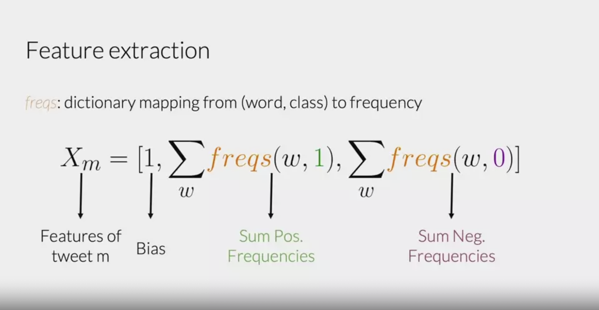

# NLP Specialisation: Logistic Regression for Sentiment Analysis:

- As always, the workflow in any machine learning project goes: fetch data -> clean data -> feature engineer -> train/build model.
- With NLP, the more interesting part is the feature engineering, this is because going from text to vectors isn't a trivial idea. 
- There are many ways: bag of words, word embeddings, TFIDF, count vectorisers etc. 
- The goal of this course, is to formally understand different text to vector transforms that are commonly used in industry. 

## Objective: Classify Tweets into Binary Sentiments:

### Basic: Text -> Vectors - Bag of Words:

    Methodology: 

    - Create a vocabulary of all words in the training dataset. 
    - Then for a piece of text to vectorise: for each word in vocabulary of length N, create an N boolean vector, with 1 if the word in text is present in the vocabulary, and 0 if the word isn't in the vocabulary.
    - A lot of zero's in your vector is known as a sparse representation. (like a sparse matrix!)
    - Output vector size is number of words in vocabulary, thus in logistic regression, need to train N features. 

    Pro's:
    - Easy to understand and implement. 

    Con's:
    - Becomes very computationally expensive when vocabulary sizes are huge, and reduces latency/increase prediction time. 
    - Lots of unnecessary features, eg: if "the" is in vocabulary, it is unlikely this is going to help us understand whether a tweet is positive or negative. 
    - Sparse matrix

### Basic: Text -> Vectors: Class Frequencies:

    Methodology: 

    - Similarly, create a vocabulary of words in the training dataset. 
    - For each word, count the number of appearances in the datapoints of each class. Eg: for the word "great" count the number of times it appears in the "positive" datapoints and "negative" datapoints. Can think of this as a "frequency dictionary", for each word: we output the number of appearances in each class. The idea is that words appearing in both are frequently are likely to have worse predictive ability. Eg: the word "the" is likely appearing in both positive and negative classes equally. 
    - A higher value one class but another implies that more words are found under the class with the bigger number. Eg: happy/good/amazing wuould have a high positive class frequency but a low frequency in the negative class.
    - Output vector is of length num(classes) +1, where first value is 1, then each remaining element corresponds to a class. The order can be arbitrary, but the idea is if the (i+1)th element corresponds to the ith class, then the value of the element/feature in the output vector is the sum over the frequencies for each word for the ith class.

    Pro's:
    - Easy to understand and implement. 
    - Output vector size is equal to number of classes +1, 
    - Quicker training time as fewer parameters.

    Con's:
    - Doesn't remove any features. 

### Common NLP Preprocessing: 
- Remove stop words + punctuation. 
- Stemming/Lowercase: used to ensure similar meaning words aren't unncessarily increasing number of features. eg: "running", "run" both map to: "run". 