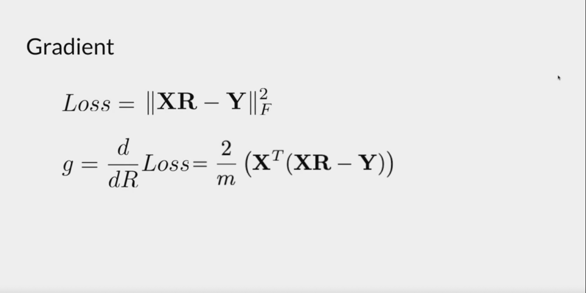
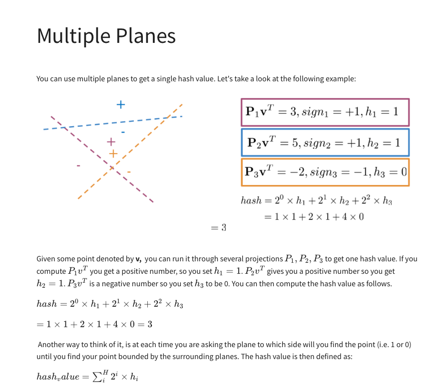
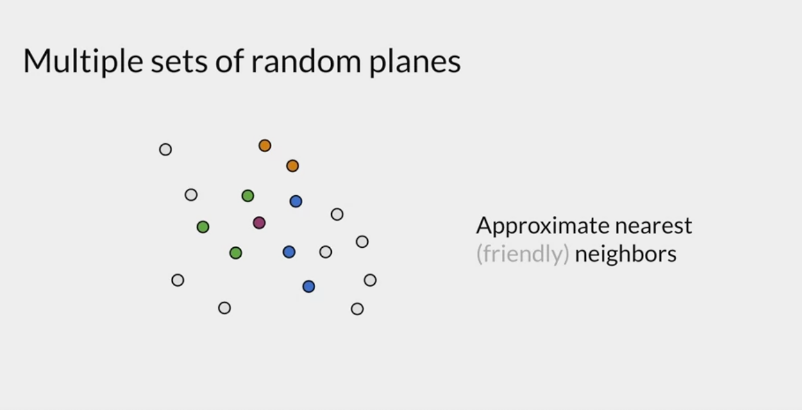

# Machine Translation + Hashing:

- We saw our vector based models will require a fast lookup to understand which word embeddings are closest to a particular vector. 
- Here we will learn about transforming vectors, locality sensitive hashing and K-Nearest Neighbours. 

## Transforming Vectors: 

- Consider the use case of converting english words to french words. How do we do it: 
    - We generate word embeddings for words in both languages and store them.
    - Then construct a matrix that can map the english words -> french words. 
    - Given a new english word, apply this transformation matrix to get a word embedding in French. 
    - Find the nearest word embedding corresponding to an actual french word.
- Note: you still need to have word embeddings for all possible words, but can train on a subset. 
- So how do we create this matrix: We essentially do a gradient descent. 
    - Initialise a random matrix R as our transformation. 
    - Calculate the predicted output (XR) and work out the Frobenius Norm between the predicted output (which is a matrix of word embeddings), and the actual word embeddings. 
    - The dimensions of this matrix are trivial: we want the same number of columns as the dimension of our output word embedding, and number of rows to be dimension of input word embeddings. Thus if (m) = input dimension, (n) dimension of output embeddings, then R is mxn. 
    - Improve the matrix R by using gradient descent. 

    

## Hashing: 

- We know that once we have a transformation matrix, we can predict the output word embedding; from which we do a search for the closest word embedding already created. (which is really a vector search).
- How do we ensure this search is quick: that's what Hashing is about. 
- We know that from our dictionaries work, search can be done quickly using the fact locations for types/items will only be in a specific location. For example suppose we organise our wardrobe by colour, if we want to know if we already have a particular tshirt in the exact colour, we only need to search the part of the wardrobe with that colour. 
- A hash function maps vectors or items to a particular value. The value can be thought of as a particular bucket of where this item would be stored/found. 
- In the vector search case, if our hash function can map vectors to values where similar hash values means closer vectors, we only need to search for the vectors that have a similar hash value to find the nearest word embedding. 
- So now we've broken the problem down of vector search into mapping similar vectors to similiar values. "Similar" is a bit vague and can be interpreted as cosine similarity or euclidean distance, or other distance metrics. 

### Locality Sensitive Hashing:

- A brief detour in Linear Algebra:
    - If we have a plane, then we can work out the normal to this plane (P = Normal).
    - The key takeaway is that if P.v > 0, then the point v lies on the side of the plane that P is facing. If P.v < 0, then the point lies on opposide side of the plane. 
    - This is useful as we can use planes to cluster points together. 
    - Eg: consider the 2D plane: (1, 0) and (0,1) are both normals to the axis: (1,0) is normal to the y-axis and (0,1) is normal to the x-axis. Consider the point (3, 5) * (1, 0) = (3) means lies on the positive x-axis AND (3,5) * (0,1) = 5 means lies on the positive y-axis, therefore must be in the first quadrant. 
    - The normal vector dotted with a vector represents the vector projected onto the plane.
- So why do we care about planes? 
    - Well the idea is we can use many planes to split up our vector space, doing so creates a bunch of sub regions. 
    - For each region, we can encode it by considering which side of each plane the region lies in.
    - Then for each vector, we can work out the encoded value for the region the vector belongs in and use this as a table. 
    - Let's say we have a new vector that we want to find the nearest word embedding. We workout the encoded region value and search the closest one amongst the word embeddings with the same encoded region value. 
- This is called Locality Sensitive Hashing, as the hash value is based on the distance between our inputs. 
    - We first construct "suitable" planes to divide by our vector space. (say we have N planes). Note we can construct planes by using the normal to a plane, we don't explicity need the equation of the plane. Eg the vector (1, 0), encodes the y-axis as (1,0) is perpendicular/normal to the y-axis. 
    - For each vector we compute the dot product with the normal vector of each plane. (telling us which side of the plane it belongs to)
    - Each vector we encode with an N dimensional vector, made up of ones and zeroes, based on if it lies on the positive normal side (1) or negative normal side (0). 
    - We can map this N dimensional vector to a number which is an encoded value for that region (all vectors in that region will map to this one value).
- Formally the hash function here is: 

- Given some planes in our vector space, we can now do a fast search of a vector to the nearest word embedding. 
- The question now becomes how do we choose the optimal planes/number of planes? 
    - Again, planes are encoded by their normal vector. To draw the seperation plane, we can apply a rotation matrix. 
- Well, we can't exactly know the best planes to use as it's not a problem that's easy to pose/solve. Instead we create many sets of planes (lets call it M).
- For each set of planes, we create the hash table, and use the hash function to find the region with nearest vectors/word embeddings. Each plane, might give a slightly different set of vectors (so more vectors to search) but it still reduces our vector search space to a subset of all embeddings.
- Nn the below suppose we're trying to find the closest embedding to the purple point: one set of planes might yield the closest embeddings as the green points, another embedding might yield the orange and a 3rd set might yield the blue points. 
- We've still reduced our search space and doing so creates a more robust/sure way that we've found the "closest" embedding. 
- This is called "Approximate Nearest Neighbours". 

- Note: to get the word embedding for a sentence/document/text we sum over the word embeddings for each possible word. Also a document doesn't necessarily have to be a big chunk of text, can also be a small sentence. 
- For document search, we can search for a phrase by storing the word embeddings for each combination of words, then applying the nearest neighbours method above. 