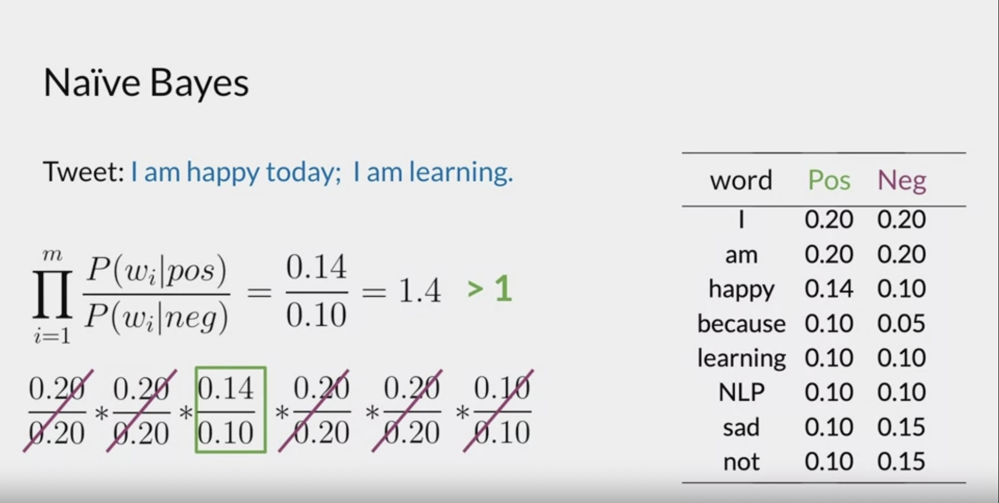
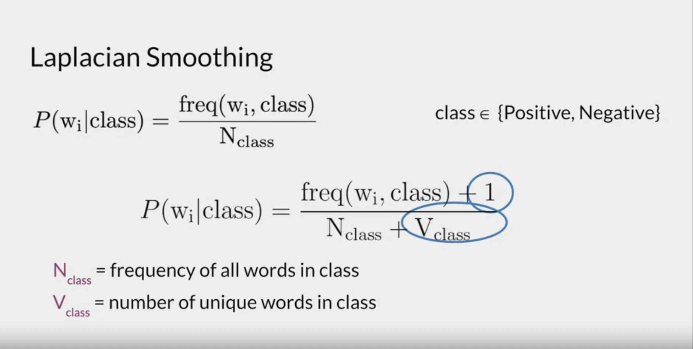
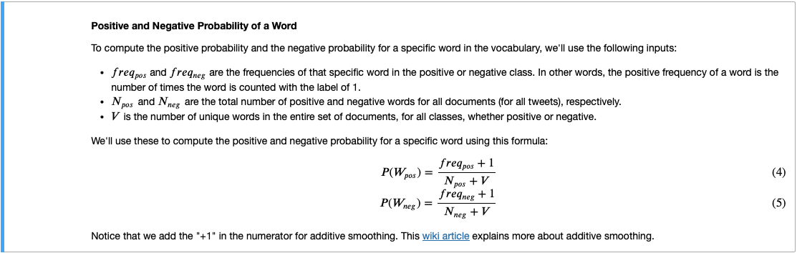
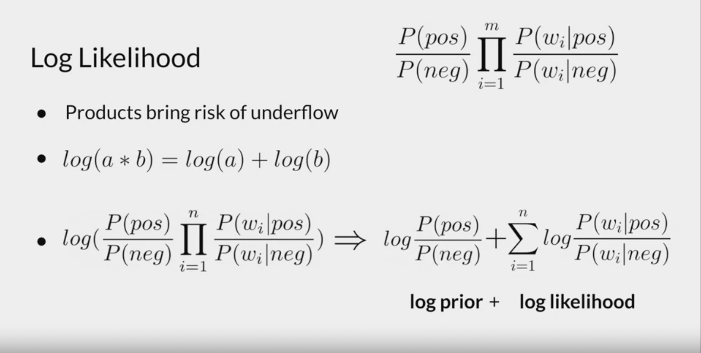
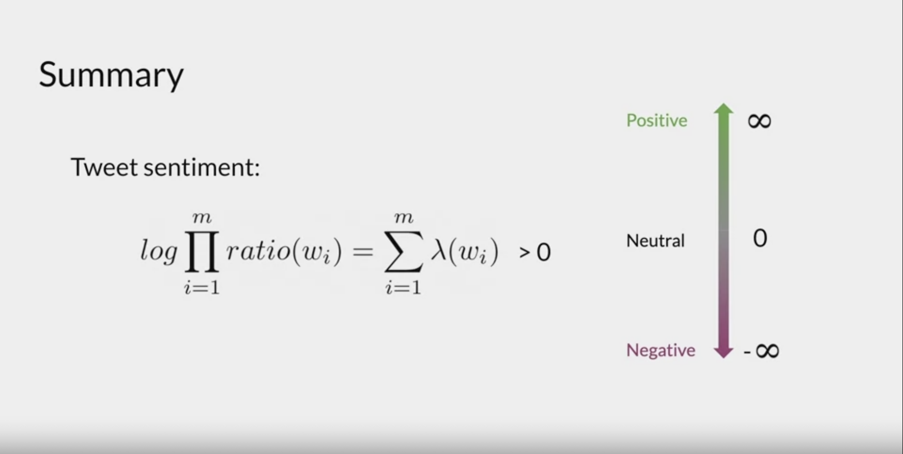

# Sentiment Analysis - Naive Bayes:

- We know we can work out probailities conditioned on events, using the conditional probability formula. 
- Conditonal probabilities are used when we know a particular event has occured: eg: what's the probability this tweet is a happy tweet, given it contains the word "great". 
- Naive Bayes classifier, uses conditional probabilities to classify tweets. 
- The "naive" term in Naive Bayes, comes from the fact we assume independence in the features we're using. 
- Naive Bayes is a binary classifier, so to extend for multiclass, need to either use "One vs Rest" or "One vs One"

## Pretraining/Hypothesis Function:
- We think of every supervised machline learning algorithm as outputting the probability a datapoint belongs to a class: P(k | x). 
- In the sentiment analyis case we would want to compute: P("positive" | "I am really happy").
- The NLP case requires one step that regular Bayes classifiers may not use: working out word probabilities for each class. 
- To this end: we apply the following: 
    - Work our class frequencies for each word. 
    - Divide each class frequency for each word by the TOTAL (not distinct) number of words in the class corpus. (all datapoints per class). This gives us the set of probabilities P(word | class), ie the number of times a word appears in a class / number of datapoints with class as label. 
    - We use the following hypothesis function:

    

    - Intuitavely the formula compares the proability that each word being positive vs negative. If the value of ths hypothesis function is > 1, this imples positive as the numerators are bigger than the denominator. Otherwise, if this value of the hypothesis function is less than 1, this implies a negative class. NClass below is the number of words (non distinct) belonging to that class and VClass is the number of unique words in that class. We know that if a word doesn't occur in a class, then the probability of that word is 0 and our classifier won't be able to classify the text. To this end, we apply a smoothing which adds 1 to each frequency, implying even if a word doesn't appear in the class, we count atleast 1. This prevents 0 probabilites (which can cause division by 0).

     

    - Note: some alternatives use V (unique count of words independent of class): 

    

- An issue caused by carrying out the products for large corpusses, is words with a small frequency will have a really small value, and a product of small numbers becomes even smaller, too small infact that our machines may not be able to store the value. We know that if our hypothesis function is > 1, we predict 1, otherwise 0. It makes sense to take adapt this hypothesis function to use log-likelihood instead. This is because of the logarithmic rules: 

     

- Notice in the above formula, we've also added the term: P(pos)/P(neg), this is to normalise values in the event of class balance. This term is called the prior ratio. 
- Another thing to notice is words that appear with similar frequencies in both classes have a pos/neg ratio of around 1, which when taken log gives 0. Implying these words have lack of impact in determine sentiment of a review. 
- We can use log-likeliehood or simply the likelihood, depending on size of corpus and if risk of underflow is small. 
- We can see the second term of our log-likelihood is the same of the logs of the quotients of p(w|positive)/p(w|negative). We call this the **lambda** value of a word. Thus for each word we can create a **lambda** dictionary
- Formally the hypothesis function: 
    - Don't forget the log-prior value (missing in pictue below).
    - We sum the loglikehoods for each word in our text:

     

     - By summing over the likelihoods, each word is treated independently, therefore if we have "not good" the likelihood of "good" may overpower the likelihood of "not", leading to the text being classified as "positive". This is a limitation of Naive Bayes. 

- Note: the training data for Naive Bayes should be cleaned: 
    - remove punctuation
    - remove stopwords
    - lowercase letters
    - stemming
    - tokenization. 

## Naive Bayes Assumptions:
- Assume that the features are independent. This seems unlikely in the case of sentiment analysis: eg: p("negative" | "rubbish) != p("negative"). 
- We assume frequency words dictionaries are balanced and represent the distribution of words at inference time. 
- NB is better when we have balanced datasets. 

