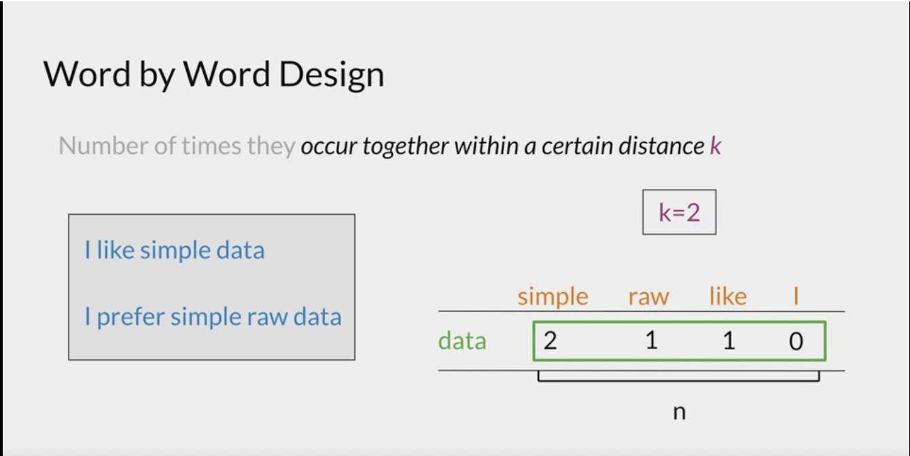
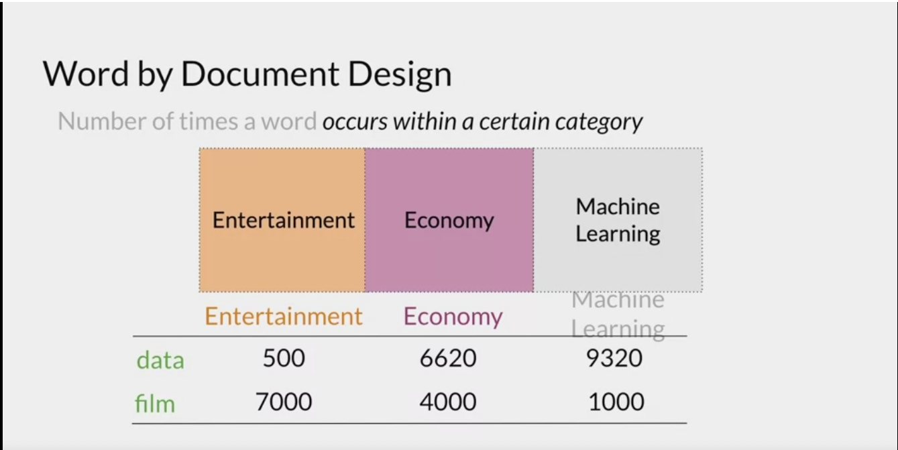

# Vector Space Models: 

- Vector space models are useful as we can use linear algebra to compare words. 
- The idea behind vector space models is to represent words as vectors. (called word embeddings)
- These vector representations would ideally be generated using context, ie: words that are similar in meaning will be closer. eg: adjectives, verbs, nouns. 

## Basic Word Embedding Generation: Word by Word:

- We specify an integer value of k, we then create a square (NxN) matrix where N = number of words in text. (This is called a co-occurence matrix).
- Each row, column corresponds to a word-word combination, and the value of the matrix at this point is the number of times word_1 is within k (distance/words) of word_2. 

 

 - The vector representation of the word "simple" is basically the 1d-vector (2). 
 - Note the column of this co-occurence matrix is what form the word embeddings. 

 ## Basic Word Embedding Generation: Word by Doc:
 
 - Here we create a word embedding by looking at different corpusses containing the word. 
 - Similarly, we create a matrix with all words in the vocabulary, the rows are the words and the columns are the frequencies of each word in a variety of corpuses and each column is a word embedding for the category. Note: this creates a word embedding for a corpus!! Eg in the screenshot: Economy = (6620, 4000). 

 

 ## Vector Similarity: 
 - The basic way of measuring distance between 2 vectors is to use euclidean distance.
 - The second is the cosine similarity. Imagine we had 2 corpuses, and 1 small corpus. In the small corpus, all the words are bound to have a lower occurence, as there are just simply fewer words which will result in the Euclidean distance being higher than usual. 
 - To account for this: the cosine similarity is used to measure the angle between 2 vectors.
 - Cosine similarity works in the opposite to euclidean distance, the bigger the cosine similarity -> the closer the vectors are.
 - The idea is that we can use our vector representations to compute distances between words, and uncover underlying patterns. For example: the distances/directions between capital cities and the country might be similar, thus if we have a new country, we can move in a similar direction to the previous examples and find the city with the closest vector representation to the point where we end up. We assume here that the word embeddings are well constructed and can achieve this functionality.
- We can use PCA to visualise vector representations of words and see clusters formed. Also note: you should use mean normalisation if doing PCA with features of different scales.
- Note, the feature/coordinates outputted after PCA are uncorrelated. 