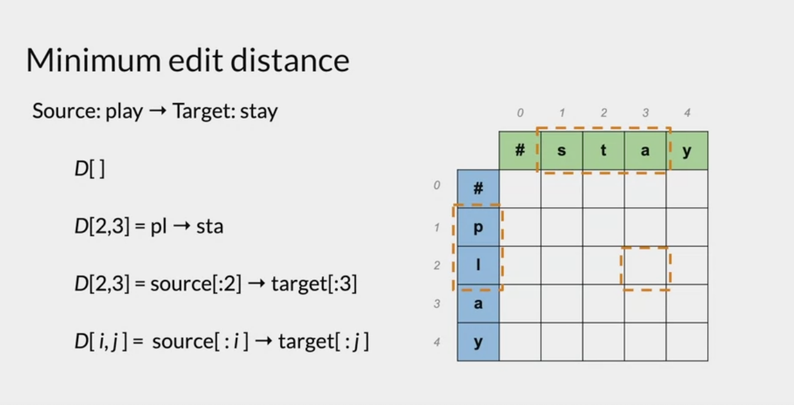
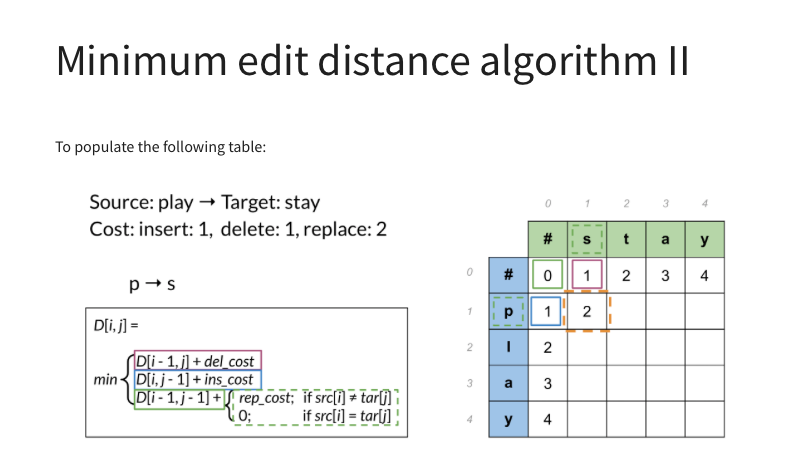

# Autocorrect: 

- In this week, we'll look at building an autocorrect system for text. 
- The system we will build will recognise spelling mistakes like "Hapy Birthday" but won't recognise contextual/grammatical errors like "Happy Birthday Deer". 

## Levenshtein Distance: 
- We know that Levenshtein distance is minimum number of steps to transform one word to another. eg: Happpy -> Happy requires 1 step, a deletion of the extra p.
- Intuitavely, we can think of autocorrect as picking the word with the closest levenshtein distance.
- Foramlly, the possible steps are: 
    - Insert (add a letter).
    - Delete (removal of a letter)
    - Switch (swap 2 adjacent letters - ONLY ADJACENT)
    - Replace (change 1 letter to another)
- Formally the autocorrect model we will implement will:
    - Identify a mispelt word. (compare against known words)
    - Find all the strings within n edit distance away. 
    - Filter Candidates by only picking the strings that are actual words from the last step.
    - Calculate word probabilities and choose the word that is most likely to occur. We can also try to choose the word most likely based on context. (though we won't do that here). 
- We can try to measure/gauge context like we did in chapter 1: by looking at the nearby words. 
- Instead, to measure likelihood: we apply a Counter instance to a large body of text, then divide the word frequencies by the total count of words. 
- We will also implement a weighting/cost system to each edit, which will be used to workout the levenshtein distance:
    - insert = 1
    - delete = 1
    - replace = 2 (can be thought of delete + insert)

## Minimum Edit Distance:
- Ideally, we want to find the closest word string to the string we're applying autocorrect on. 
- In some cases 1 edit isn't enough generate a new word, especially when we have long strings. 
- Suppose we phrase our problem as how can we compare 2 strings, well we can workout the smallest numbers of edits needed to take one word to another. 
- We can imagine this is a complex operation when we have lengthy strings. To this end, we go through a dynamic programming approach which will improve the time complexity. 

### Dyanmic Programming Approach to Minimum Edit Distance:
- Our goal is to construct a table like below, which will depict how many operations it takes to go from one substring of a string, to a substring of another string. Remark: these substrings that we take are only from the start of the string. 
- You'll notice that the bottom right corner element is the minimum edit distance from the entire first string to the entire second string. (which is exactly what we're looking for).
- By filling this table iteratively, we will break the overall problem down into sub-problems. (this is how dyanmic programming works - a bit like binary search)
- Note: the table below has hashes (which represent empty strings). The splices of strings are endpoint included. 

- There are usually multiple ways to go from one substring to the other, we can create all the paths and set the matrix entry to be the minimum distance of the paths.
- Creating the first row/column is very straight forward. Once we have that, we can then update each matrix entry iteratively using the following update method: 

- Suppose we have 2 strings that we want to know the minimum edit distance. Let's think of each string as a list (x and y) where each element is a character. 
    - If we know the minimum distance between x[:-1] and y then we only need to insert 1 to get the distance from x to y.
    - If we know the minimum distance between x and y[:-1], then we only need to delete 1 to get the distance from x to y
    - If we know the minimum distance from x[:-1] and y[:-1], then we only need to at most replace to get from x to y. I say at most as if the added letter to both strings is the same, then no need to replace. 
- Note: you might have values elsewhere in the grid that are bigger than your overall minimum edit distance. This is because some methods enforce a deletion then insert when in reality you don't always need to do this. (eg in the case the extra letters are the same).
- Note that this algorithmn doesn't tell you the path taken from start to finish, if we were interested in this, then we need to implement a method called "backtrace". 
