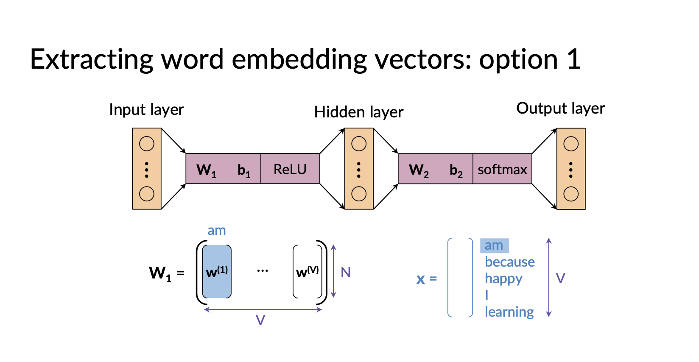

# Generating Word Embeddings: 

- There are 2 main easier ways of generating word embedddings: 
    - Skip Grams
    - C.B.O.W = Continuous bag of words. 
- Deep Learning Approaches: 
    - BERT
    - Elmo
    - GPT

- There are other deep learning methods but the main methodology we will discuss is CBOW. 
- Ideally, we want our word embeddings to carry meaning/context of a word, this then allows us to cluster similar words. 

## CBOW: 
- The methodology behind CBOW, is to train a shallow neural network which takes in inputs as the words surrounding a particular word and the prediction is the particular word. 
- Typically: 
    - We start with a corpus of text and clean it using common cleaning techniques: removing punctuation, lower casing words (wouldn't want different word embeddings for uppercase/lowercase). 
    - We then create a sliding window over our corpus, taking a particular word which we treat as a center word then take C (C is a hyperparam) words on either side of the center word. From which we take the average of the one-hot encoded vectors to be our input vector. 
    - We then train a neural network with 1 hidden layer as N nodes, (N is another hyperparam = embedding size). First hidden layer we apply RELU and output layer we apply softmax.  

    - 
    - We can train this neural network in batches. 
    - Once we've trained the model we have 2 ways of obtaining our word embeddings:
        - Either use the first matrix params, where the $j^{th}$ column corresponds to the one hot encoded vector with $j^{th}$ entry as the only 1:
        - 
        - OR we can use the second matrix of parameters, where the $j^{th}$ row corresponds to the one hot encoded vector with $j^{th}$ entry as the only 1: 
        - 

## Testing CBOW and Drawbacks: 
- The main drawback fo CBOW is that we can't generate word embeddings for unseen words. 
- We can test our generated word embeddings by clustering and checking if similar words are close together. Can visualise this using PCA. 
- We can extrinsically test the embeddings, by using them to solve a problem. If after so much modelling the performance for our solution to the problem is poor, it implies there could be somethign wrong with the embeddings. 
- Extrinsic evaluatio is much more costly as have to train a whole different model. 
- In general, use the nltk package to tokenize as there are plenty of preprocessing/tokenization functions. 
- Extrinsic evaluation is good as it allows to evaluate effectiveness of our word embeddings to a real problem. 