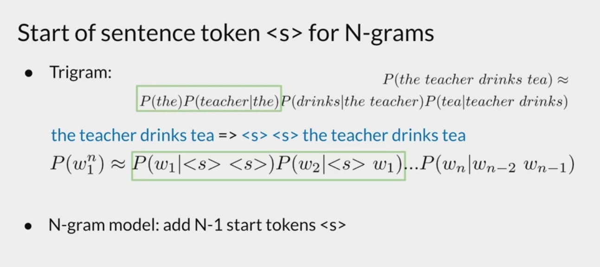
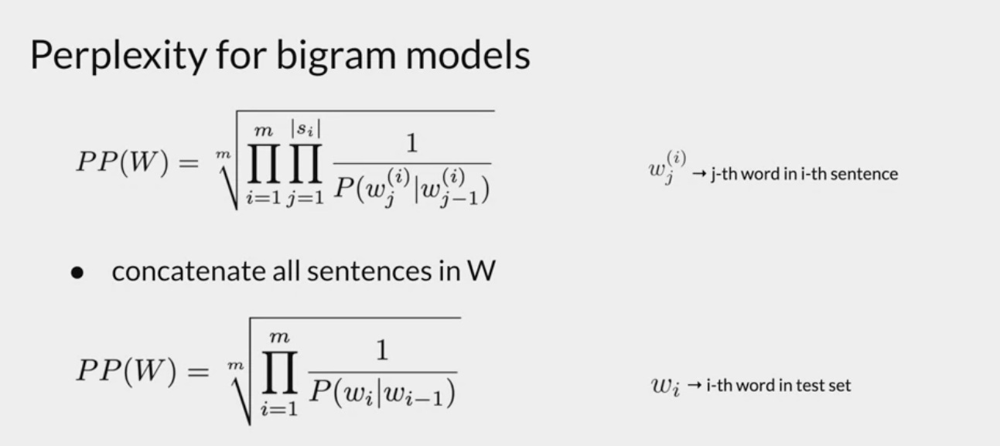
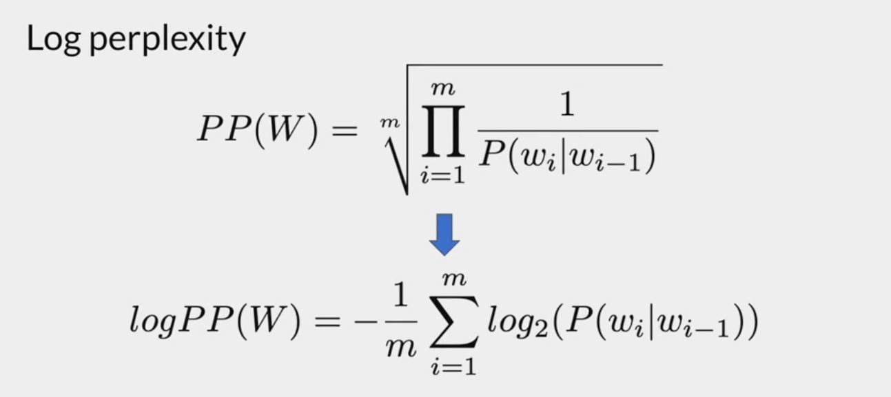
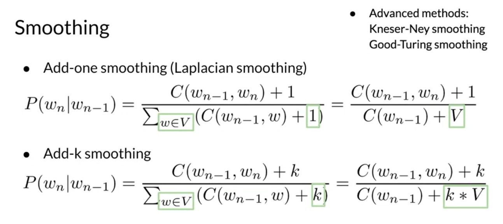

# N-Grams: 
- N grams are useful for calculating probabilities of words appearing together in a specific sequence. 
- They also powerup more complicated language model that we shall see later. 
- We can think of our goal as working out the probability of a sentence occuring. 
- We should be mindful of:
    - Handling out of vocabulary words.
    - Smoothing for unseen sequences of words. 

## N-Grams:
- N-grams are simply sequences of N words. 
- Unigram correspond to single words, bigram corresponds to pairs of words, trigram corresponds to 3 words together etc. 
- N-gram means sentences of N-Words.

## Assigning Probabilities to N-Grams: 
- Suppose we want to know P("Is" | "My Name"), which is the probability of "Is" following "My Name". We can define this as the count of C("My Name Is") / C("My name"). (Where C corresponds to the count function applied to the corpus)
- Formally: 
    - $P(D|A,B,C) = C(A,B,C,D) / C(A,B,C)$
- On top of this we can apply Bayes Rule to get the probability of a sequence: 
    - $P(A,B,C,D) = P(D|A,B,C) * P(C|B,A) * P(B|A) * P(A)$
- The above, is how we would workout probabilities, however this method relies on us having seen the sequene C(A,B,C,D) within the corpus, which is likely not the case, and the probability will get even smaller, the larger N-grams we take. 
- Instead we apply the Markov Property Assumption, which assumes the probability of a word occuring given its history, is dependent only on the previous N words. (Markov assumes N=1, but we can use N as we like) 
- Notation: 
    - Words = $w_1, w_2,......w_N$
    - $w_1^3$ = $w_1,w_2,w_3$
    - $w_j^i = w_j, w_{j+1}, w_{j+2},....,w_{j+i} $
    - $P(w_n|w_1^{n-1}) := C(w_1^n) / \sum_{w}C(w_1^{n-1} w) = C(w_1^n) / C(w_1^{n-1}) (***)$
    - Markov Property Smoothing (aka: N-Gram Probability): $P(w_k|w_1^{k-1}) = P(w_k|{w_{k-N+1}^{k-1}})$
    - Bayes: $P(w_1^n) = \prod^{n}_{i=1}P(w_i|w_{i-1})$

## Start and End of Sentences:
- You'll notice that at the end of probability of a sequence eventually ends in a term: $P(w_1)$, ie: multiplying by the probability of the first word. However we haven't defined the probability of a single word, but we would like to use a similar formula to the probability of an N-gram whenever we use an N-gram model. 
- Similarly, if you were to have a Trigram model, where the probability of each word is dependent on the previous 2 words, the first 2 terms don't have enough context, Ie: we can't use the same formula to work out probabilities. 
- If we consider the formula for probability of an N-gram above (***):
    - Suppose a word is the end of a sentence in the corpus, and the same word is second to last in another sentence in the corpuse.
    If we take the last N-gram of the second sentence
    - Then the equality in our formula: $\sum_{w}C(w_1^{n-1}w) = C(w_1^{n-1})$, is not true as we have an extra count in the second formula caused by the first sentence. 
- To this end, we introduce the starting and end token denoted as: "$<s>$" and "$</s>$". We do this so that we treat the start token and the first words as conditionally independent: $P(w_1) = P(w_1|<s>)$ 
- If we're using an N-gram model then we need $N$ start tokens, but only 1 end token. 
- Note: all of the above was to ensure our N-gram formula for probabilities is well defined. 

- 

## Common Preprocessing: 
- lowercasing text.
- remove non-alphanumeric characters
- split text into sentences
- split sentences into list of words

## N-Gram Language Model:
- We can think of a language model as a model that assigns probabilities to sentences.
- We can see to create probabilities of N-grams it would be very useful to have a count matrix. 
- To this end we create a count matrix which has:
    - rows as all posible (N-1) grams.
    - columns as unique words in the corpus.
- Thus, $C_{i.j}$ corresponds to the count of the $i^{th} (N-1)$ gram with the word in the $j^{th}$ column. 
- Recall the probability of an N-Gram: 
    - $P(w_n|w^{n-1}_{n-N+1}) = \frac{C(w_{n-N+1}^{n-1}w_n)}{C(w_{n-N+1}^{n-1})}$
- From this count matrix we can create a probability matrix, which will hold the probability of each N-gram. We do this by dividing each entry by the row sum. This is because the row is the count of the instances of that particular $(N-1)$ gram.
- Next, if we have a sentence, and we want to know the probability of this sentence:
    - We first use Bayes Rule to split into a series of N-gram conditional proabilities. (here we've implicitly used the Markov Property) 
    - We then use our probability matrix to get the probability of each N-gram. 
    - Then substitute these values into the Bayes formula to get the probability of the sequence. 
- Like other models this is going to be a product of small probabilities, so instead we can apply the log function to break into a series of sums.
- Generative models can use these N-gram porbabilities to auto complete text.

## Evaluating Language Models: 
- Perplexity is one of the key metrics used to evaluate a language model. 
- As usual with an ML model, we split the dataset into train -> cv -> test.
- We can think Perplexity as a measure of confusion.
- If we a text has a high probability, but doesn't look very readable, then we consider this to have a high perplexity.
- Whereas if a text generated is human readable, then we have a low perplexity. 
- If the test set has a high probability then we have a low perplexity.
- Formally: 
    - m = dataset size
    - $P(W)$ is the product of the probability of all sentences in the test set, multiplied together.
    - Perplexity(W) := $PP(W) := P(W)^{-\frac{1}{m}}$
    - Mathematically: 
    - 
- A good perplexity is between 20 and 60. 
- We can also use the Log Perplexity of a model: 
- 
- A good log-perplexity is between 4.3 and 4.8.
- Note: Only use Perplexity to compare LM's with the same size vocab, as we can see the perplexity gets worse for more data points.

## Out of Vocabulary Words:
- We know that it's possible our model is used for words that aren't in the vocabulary/ words that haven't appeared in a particular order. 
- Unknown word = Out of Vocabulary Word. (OOV - missing from training data)
- One work around is to replace OOV words with a token called "$<UNK>$", or in training data replace low frequency words with $<UNK>$, that way our probability matrix will have references for unknown words/we can still work out probabilities. 
- Now the question becomes, how do we decide which words to replace with $<UNK>$, in the corpus? We can setup possible criteria: 
    - Minimum word frequency(f): if word doesn't appear atleast (f) times, then replace
    - Set maximum size of known vocabulary size, and pick those with the highest frequency, replace remaining words. 
- Be careful, if too many $<UNK>$ tokens, can end up with a low perplexity but isn't really producing anything of value. 

## Smoothing: 
- As we mentioned above, we can always run into situations where all words are present in the vocab, but don't appear in that particular order in the corpus. As different ordering, the probability of that N-gram will be 0. 
- Possible work arounds: 
    - Laplacian Smoothing: Add 1 EVERY count term. (be careful of denominator)
        - Note: in this case we should only use this if the V term, (ie the row sum in the count matrix >= 1), as otherwise the probability will be too high. 
        - 
    - Add k Smoothing: Add k to EVERY count term. 
        - Even greater smoothing effect vs laplacian. 
    - Backoff: If N-gram count is 0, use the N-1 gram count, (if still 0), use N-2, .... etc. 
        - Not good for small corpus. 
        - Requirements redistributing probability distribution. 
        - Stupid backoff, applies a 0.4 scaling if backoff is used. 
    - Interpolation: Suppose we're using N-grams, we apply a weighted scaling factor going from N down to 1 ($\lambda_1, \lambda_2, ...., \lambda_N$). For a particular probability term, if we use an $(N-k)$ gram, we multiply that probability by $\lambda_{N-k}$. 
        - This is similar to backoff, but we force ourselves to use lower order grams.
        - The $\lambda_i$ terms can be optimized using MLE. 