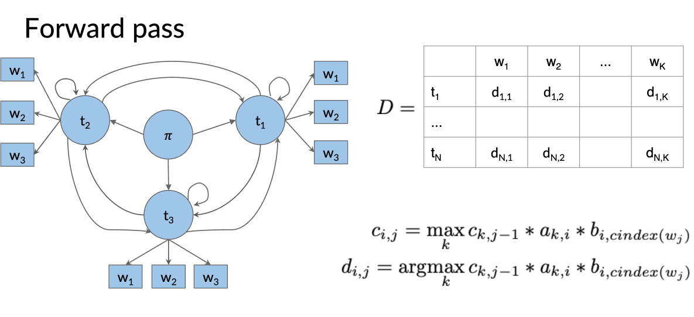

# Speech Tagging:

- Speech tagging is the process of ascribing "noun", "adverb", "adjective", "pronoun", "punctuation" etc to words in a corpus. 
- We need this as we can use POS (part of speech tagging) to disambiguate words in sentences.
- For example: 
    - "You did really well on that test"
    - "I found money at the bottom of a well"
    - The word "well" has 2 different use cases, the first being an adjective, the second being a noun. 
- By disambiguating the tag of the word, this can help to improve language model performance.
- Here we will learn how we can assign tags to an entire sentence using the Viterbi algorithm.

## Methodology: 
- The idea is we will use Markov Processes to determine the state of a word, where the states are types of words: adjective, noun, pronoun, verb, advert etc.
    - Recall, the idea behind a Markov chain is the next state given the current/previous states, is only dependent on the current state. 
    - Intuitavely, this says whether a word is adjective, noun, etc is dependent only on the type of the previous word. 
- This is clearly a supervised model in the sense we neeed some training data that is already tagged. We then apply the following steps:

### Notation: 

- Set of Tags: $\{ t_1, t_2, t_3, ..., t_n \}$
- Training Corpus of Tagged Words: $\{ w_1, w_2, w_3, ...., w_m \}$

### Step 1: Transition Matrix:
- We can create the transition matrix which consists of the probabilities of jumping from one state to another. 
- We do this by counting the number of times one state (j) is followed by the state (i) and dividing this by the total number of times state (i) is present. 
- One slight error with this, is if one pair of state doesn't occur then we wouldn't want the probability to be 0. (as it's like you can place any 2 words together in a sentence). To this end, we apply a smoothing hyper parameter to ensure the probability isn't zero:

- 

- Note: N is the number of unique tags not the total count of tags. 
- Note: Transition Matrix is an $(n$ x $n)$ matrix.
- Note: In some cases will be $((n+1)$ x $n)$ matrix, where the initial row encodes the initial distribution. Which we calculate as the starting distribution given by the first word of each training datapoint. 

### Step 2: Emission Matrix:
- The model is built around the idea we want to be able to predict the state of the next word given the current word. We don't want to predict the next word given the current word. 
- To this end, we create another matrix called the Emission Matrix which is an $((n+1)$ x $m)$ matrix.
- Which we think each entry as the probability a word "emits" from a state. Which more formally is the proportion of the number of times a word is in a particular state, divided by the total (non unique) count of words in that state. 
- Similarly to the transition matrix, we apply a smoothing factor, allowing a word to be emitted from any state: 

- 

### Step 3: Hidden Markov Model: 

- Combining the above and excluding smoothing, we've essentially created the below model:

- 

- It's called the Hidden Markov Model as the states are hidden in the sense of predicted word state to another word state implicitly uses the transition states to move around. 
- The Transition and Emission matrices can be used to label each of the arrows in the HMM. 
- Using this model, we can jump from word to word, attempting to pick the path that generates the highest probability of being picked. 
- In the above HMM, suppose we have the sentence: "I Love to Learn". 
    - The below outlines 2 paths that we can take. Note the brackets contain the state we jump to:
    - I(O) -> love(NN) -> to(O) -> learn(VB)
    - Predicted Tags: O, NN, O, VB
    - I(O) -> love(VB) -> to(O) -> learn(VB)
    - Predicted Tas: O, VB, O, VB
    - The first being slightly incorrect as "love" is a verb in this sentence. 
- Our prediction method is to pick the path that gives the highest probability. Note we multiply the transition and emission probabilities when going between words. 
To this end, we will go through the Viterbi algorithm, which is a graph algorithm which helps us find the path with the higest probability. 

### Step 4: The Viterbi Algorithm: 
- As mentioned above, the Viterbi algorithm is a dynamic programming algorithm that will help us find the path with the highest probability. So that we can assign tags to pieces of text with the highest probability. 
- Intuitavely the Viterbi algorithm creates 2 matrices both with dimensions $(n$ x $l)$, where $l$ is the length of the text we're trying to assign speech tags to:
    - One matrix keeps track of the probabilities that each word in our text belongs to a particular state/tag. 
    - One for keeping track of which state the previous word was assigned used which gave the highest probability of the current state. 

- The Viterbi Algorithm created these 2 matrices (called C, D) and is broken into 3 steps: 
    - Initialisation (starting matrix creation - setting first column)
    - Forward Pass (assembling matrices, column wise priority)
    - Backward Pass (finding the optimal path)

- Note again: both matrices have dimensions $(n$ x $l)$, we can think of the ($i^{th}, j^{th}$) entry corresponding to some relationship between the $i^{th}$ state and the $j^{th}$ word in our text

#### Initialisation - First Columns:
- We initialise the first column of D to be zero, this is because there are no words preceeding the first word. 
- $C_{i,1}$ is the probability that the first word is emitted from the $i^{th}$ state. To be emitted from $i^{th}$ state, we need go from the initial state, to the $i^{th}$ state, then be emitted to the word. 
- In the below diagram, consider b to correspond to the emission matrix. 

- 

#### Forward Pass - Remaining Columns:
- For the remaining columns of the C matrix:
- $C_{i,j}$ is the highest probability path (across all paths) that we end up at state ($i$), for the $j^{th}$ word. This is calculated iteratively, column wise:
    - We know from initialisation, that the first column is the probability of being emitted to the first word from various states. 
    - For the second column, entries $C_{i,2}$, will be the largest probability that the second word belongs to state $(i)$, which is also equal to the maximum of: "P(being at state k for first word) * tranisition from state $(k)$ to state $(i) * $ P(emitting word $j$ from state $(i)$).
    - Doing this, the second column holds the highest probability paths, which we can repeat iteratively. 
- This corresponds to taking the maximum of $"c_{k, j-1}t_{k, i} * b_{i, index(j)}"$ for any $k$ where t corresponds to transition matrix, and b corresponds to emission matrix. 
- Further, we set entries of D as: $D_{i,j}$ to be the state from which we travelled which maximised the probability at $C_{i,j}$
- Formally: 

- 
- 

#### Backward Pass - Final Path: 
- Thus once we have the 4 matrices:
    - Transition Matrix (A)
    - Emission Matrix (B)
    - Maximum Probability (C) Path Matrix
    - Backtracing (D) Matrix. 
- We can find the overall path with the highest probability for this text:
    - First we go to the final column of C and find the entry/state with the highest probability (this is the state of the final word)
    - We then go to the same indexes but in the D matrix, which will tell us the state of the previous word, which leads to the highest probability in the final column
    - Repeat for the second to last column.... 
    - Eventually building a path of states which is the equivalent of labelling our piece of text. 
- Formally: 
- 

## Conclusion: 
- Now we know how to tag POS (Part of Speech), using Hidden Markov Models.
- Python Notes: it's wise to use log probability when taking products in the C matrix as storing really small values gets computationally expensive. 