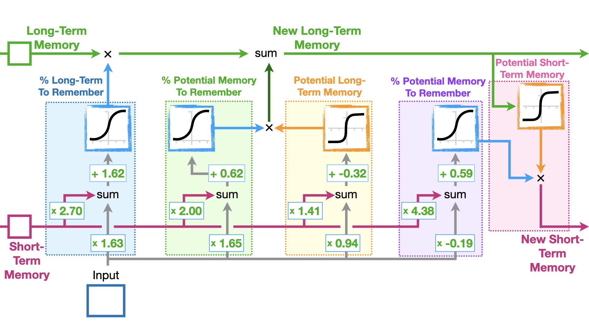

# Long Short Term Memory (LSTM) & Named Entity Recognition:

- One problem that we run into when using RNNs is the exploding/vanishing gradient problem. 
    - Imagine we had an RNN with weight as an integer: 2, and no bias terms. 
    - Then each hidden state is similar to: $h^j = 2^j * x_j$
    - In this case if we have datapoints with length 100, (which is very possible as RNNs are good for time series modelling), then we have the coefficient is exploding $2^j$. 
    - Similarly if we have a weight of a $\frac{1}{2}$, then we have the coefficient exponentially decreasing causing a vanishing term.
    - These coefficients appear in RNNs and they can either explode or vanish, which causes computational problems. 
- Note: there is a notebook explaining the exact term that blows up. 
- LSTMs are a way of getting around this. 
- LSTMs apply the idea of remembering relevant information and discarding less useful information. 
- LSTMs is made up of gates:
    - Input Gate: tells how much information to input. 
    - Forget Gates: how much information to forget.
    - Output gate: how much information to pass over. 

## Named Entity Recognition (NER): 
- Model used to extract key words from a chunk of text, for example in imessage when someone writes "lets get dinner at 7:30", iphones register as dinner at 7:30. That's because it's built to understand dinner as a verb, time is 7:30. 
- Might have geographical locations, times, items, people, search engine ranking, etc. 
- This might be cool for Campaign Stitching, trying to identify the brand name etc. 

## Training an NER System: 
- NER is a supervised learning alogrithm.
- For each tag/named entity we assign a number, and we assign "O" to a filler word.  
- We start by assigning an index to each word in our vocabulary of text. 
- For each token/sentence, we create an array of the indexxes of the words within it. 
- For each token/sentence, we create another array with the corresponding named entity numbers. (this is the output/label)
- The 2 arrays we've created will have the same length as we have a numeric value for each named entity and filler words. 
- For LSTMs all inputs must be the same length (which we set to a number), so we pad our arrays with a pad token: $<PAD>$. 
- We now have 2 arrays of numbers of the same length for each token.
- We then batch our datapoints. (usually powers of 2). 
- Feed into an LSTM unit.
- Run the output through a dense layer.
- Predict using **LOG** softmax over all tags/named entities. Note: its important to use log softmax as it provides better numerical performance and gradient optimisations. 
- Note: be careful when evaluating padding tokens as these are contained within our inputs and outputs. We don't want to inflate our accuracy unncessarily. So when checking if our labels are correct, don't include these. 

## LSTM Layer (Own Notes):
- LSTMs are good for time series data/sequential data. 
- We can use LSTM layers within a network it is simply a way of taking an input vector, applying a sequence of operations and outputting another vector. 
- A RNN will:
    - Initialise a hidden state. 
    - Apply a matrix to the current input as well as the initial hidden state.
    - Apply some activation funcion then set this as the hidden state for the next layer.
    - Make a prediction on the current layer. 
    - Each layer prediction is a prediction for the next input. 
- LSTMs incorporate a similar idea. 

- 

### Initialisation:
- Initialise the long term memory value and the short term memory value. (Both of which are recalculated at the end of an LSTM unit).
- In the below, treat $X$ as input and $S$ as short term memory. 

### Forget Gate (1st Component In Image):
- We take in the input which passes through a weight parameter: $(W_{input:forget} * S)$.
- Apply another weight parameter to the short term memory matrix/value. $(W_{short:forget} * X)$.
- We sum these 2 and pass through a sigmoid function which maps between $(0,1)$. This corresponds to the percentage of the long term memory we want to retain. 
- Hence the name "forget gate" as we are determining how much of the long term memory we use in the final prediction. 

### Input Gate (Middle 2 Components in Image):
- Apply another weight parameter to the input: $(W_{input:input} * X)$
- Apply another weight parameter to the short term memory: $(W_{short:input} * S)$
- Sum these 2 outputs and apply a sigmoid function, which again maps to $(0,1)$ as the percentage of current memory to remember for the long term.
- We then have another set of matrix that do something similar but we apply the $tanh$ activation function instead, this will give us the potential long term memory contribution. 
- Multiplying this with the % of current memory to remember we calculated, we get the value of the "long term memory" value used in the next layer. 
- This layer will update the long term value with the information from this input. 

### Output Gate (4th and 5th Component in Image):
- - Apply another weight parameter to the input: $(W_{input:short} * X)$
- Apply another weight parameter to the short term memory: $(W_{short:short} * S)$
- Sum these 2 outputs and apply a sigmoid function, which again maps to $(0,1)$ as the percentage of current memory to remember for the short term. 
- We then have another set of matrix that do something similar but we apply the $tanh$ activation function instead, this will give us the potential short term memory contribution. 
- Multiplying this with the % of current memory to remember we calculated, we get the value of the "long term memory" value used in the next layer. 
- This layer will update the short term value with the information from this input, which is fed as the short term value in the next LSTM unit. 

### General Comments
- The above describes a single LSTM unit, we would repeat the above for every input in our vector. 
- The idea is part of the old data is retained by this long term memory but also gets rid of the exploding gradient problem. 