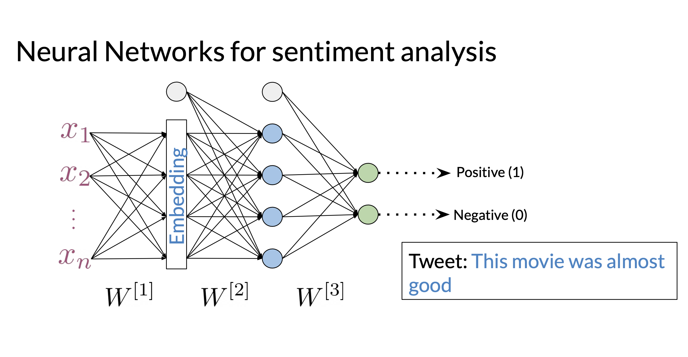
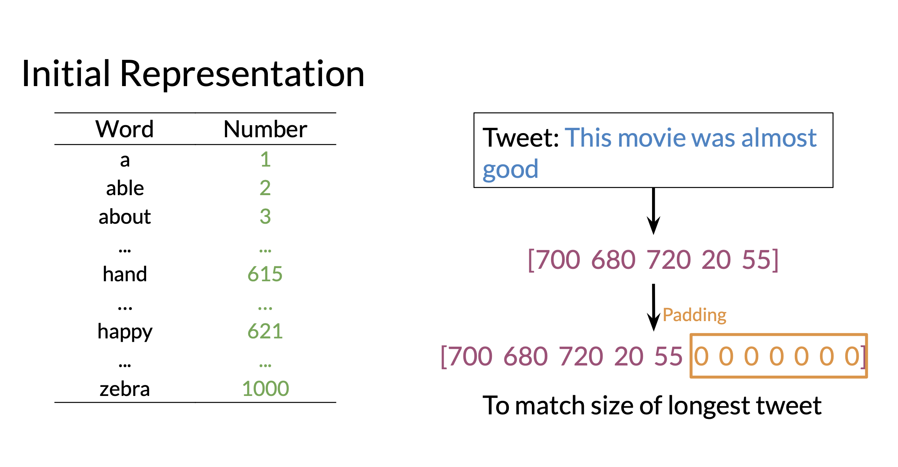
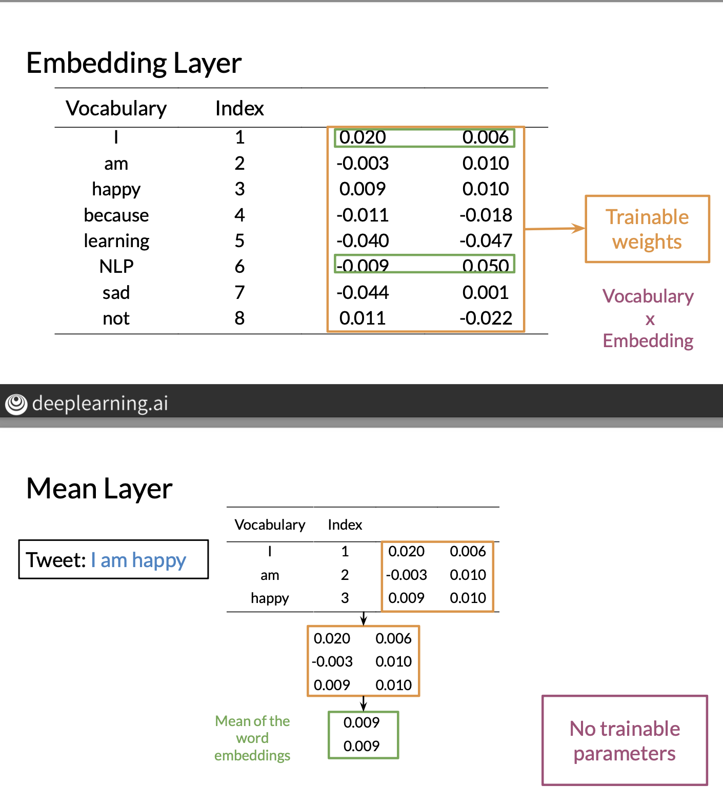

# Neural Networks + Tensorflow:

- Neural networks can have an advantage over simpler models like Naive Bayes for sentiment analysis when applying to more complex language. 
- Naive Bayes really looks at word frequencies per class and makes a prediction. Hence an example like: "I really don't like this" can be thought of as "positive" as the word "not" is unlikely to appear many times in the positive class and "like" is likely to appear many times in the positive class. 

## Architecture: 

- The following example architecture is what we might use for sentiment analysis: 

- 

- We create our input vector X:
    - First we assign a value to each word in our vocabulary. 
    - Then create a vector representation by taking value of each word and in the array. 
    - We then fill the array with zeroes so to match the length of the longest token/sentence. 
    - This is called Padding: 
    - 
    - This is a little strange and different as the first entry doesn't correspond to the same word in each array, but it does preserve the order of the words. 

## Layers: 
- The neural net is typically made up of dense layers and a series of activation functions. Typically we use the Relu function: $max(x, 0)$ on every layer apart from the final layer which will usually apply softmax. 
- We also use "Embedding Layers" and "Mean Layers". 

### Embedding Layer: 
- An embedding layer intuitavely relates to word embeddings for words. 
- Every word in the vocabulary has a word embedding that we've seen how we can generate. 
- However in this case, the word embeddings for each word are trainable values. 
- We have a set of parameters with dimensions: $|V| x |D|$, where D denotes our embedding dimension. 
- This layer essentially creates a series of word embeddings for each word and stores as a matrix. 
- As each parameter is trainable, this is another way of creating word embeddings. 

### Mean Layer:
- The mean layer takes the average of the word embeddings for every data point. 
- Based on our initialisation method described above, we have vectors of the form: [10, 23, 19, 0, 0, 0]. We can then unroll this into a series of word embeddings and taking the average/mean. 
- This is the equivalent of getting the word embedding for each word in the sentence and taking the average. 
- The main difference here is we train the word embedding parameters to optimize performance. 
- Mean layer gives a vector representation of our sentence.

