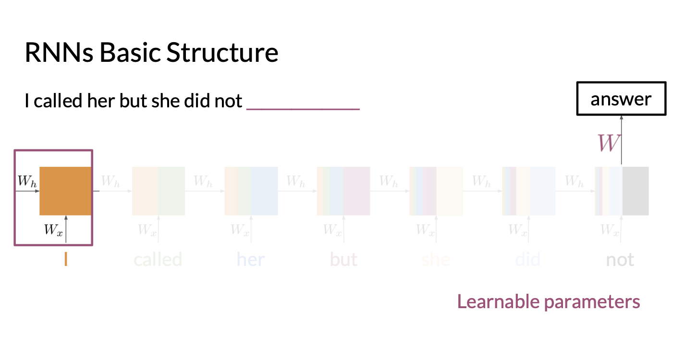
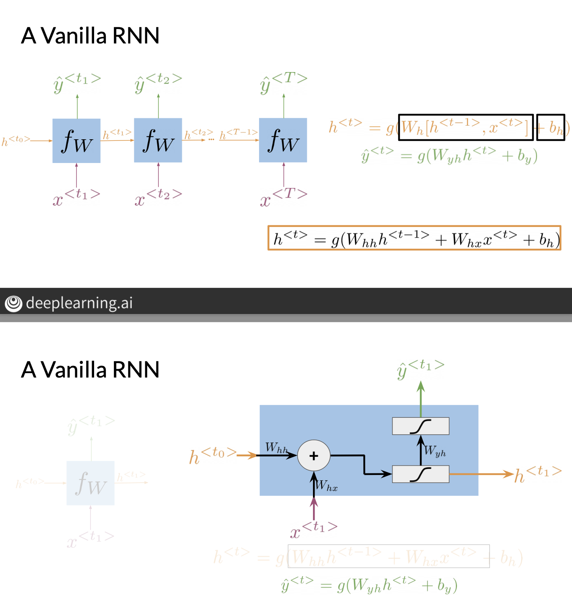
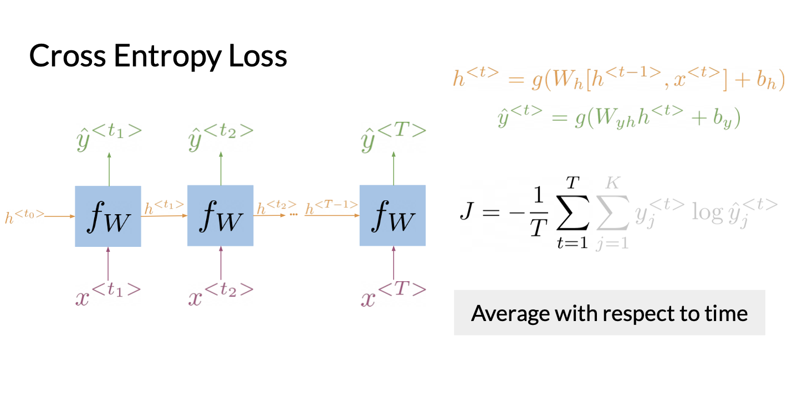
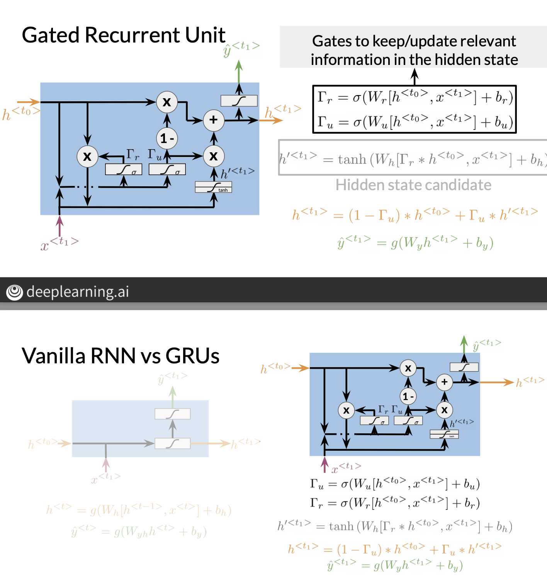
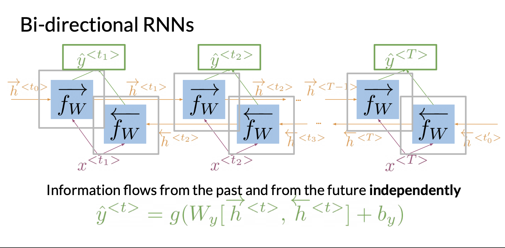
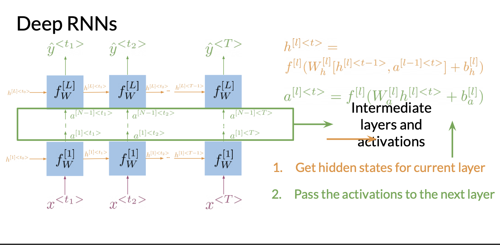

# Recurrent Neural Networks: 

- Recurrent Neural networks can be used as an alternative to a N-gram model for predicting the next word given some text. 
- N-gram models can be quite ram heavy as we need to store the word counts for all words in a corpus. 
- RNNN's also have the benefit that they can carry information both ways which allows for better text generation. 
- RNNs can compute probabilities of a sequence of words (like the N-grams model).

## Advantages of RNN's:
- Recall N-grams can be used to predict the probability of a sequence of words occuring. 
- Again, recall N-grams uses the previous $N-1$ words to gauge the probability of the sequence. Therefore to capture larger dependencies, we need to use larger N-grams, which then requires more RAM. This matters more in cases where want to use the models on phones with lower RAM. 
- RNN's carry information from the start to the end, therefore the probability is based on the entire sequence not just the previous $N-1$ words. 

## Intuition of RNN's:
- The entire sequence of inputs is used but in a way that later terms in the sequence have a higher weight. 
- The information of each word/input is scaled by a parameter: $W_x$, and inbetween layers, we scaled by $W_h$. 
- As each parameter is scaled by $W_h$ when moving between layers, the initial terms are scaled the most whereas the later terms have the least scaling. 
- In the picture below we can see the information obtained by starting words gets smaller by passing through layers. 
- We have 3 trainable parameters:
    - $W_x$: Scaling applied to each information provided by a word.
    - $W_h$: Scaling applied to all datapoints when passing between layers. 
    - $W_y$: matrix used to predict the output at the end. 
- We can see why RNNs can take a varied number of inputs, not just a fixed input length. 
- Intuitavely, "Recurrent" in RNNs follows as we apply the same parameters again and again like a recurrence relation. 
- Although the starting terms have less weight/impact in the end, RNN's still accoount for the entire sequence. 

## Different Types of Predictions:

    - One to One: Predict house price given features. 
    - One to Many: Generate captions for an image. 
    - Many to One: Sentiment Analysis 
    - Many to Many: Machine Translation. 

- RNN's are particularly useful when we start with many and have to predict, this is because RNNs carry information across through time. 

## Math Behind RNNs:
- The following diagram shows how we use our 3 trainable parameters to feed forward in our RNN: 

- In the above, $g$ denotes our activation function. 
- We can see above that each time point, we can make predictions by applying $W_y$ followed by an activation function. 
- In the NLP case I think the $t^{th}$ prediction is the probability the output is the $t^{th}$ word/input. 
- Hence we can think intuitavely that at each iteration, we have an error, we can take the average and treat like the average (over time/iteration) of the cross entropy loss: 

- We can treat the RNNs as a for loop, or repeating the same operation like in a recurrence relation. Tensorflow and other frameworks will have a "scan" function that runs this loop as it's needed for parallelisation/running on GPU. 

## Gated Recurrent Units:

- We notice that in RNNs features/information tends to vanish over time as the weight decreases. 
- Gated Recurrent Units (GRUs) are a way of getting around this. 
- The idea behind GRU's is they let information be persistent over time, eg: valuable information from the start may not vanish over time. 

- The intuitive idea is that we apply a weight when transitioning betweeen hidden states to preserve information. 
- Hidden states can be thought of as the hidden outputs that we end up while transitioning from the input to the prediction. Just like transitioning to hidden layers within a neural network.
- GRUs have a lot more computation, but allow preserving information.  

## Bidirectional RNNs: 
- Bidirectional RNNs have the benefit they can propogate information from the end to the start. 
- The methodology is identical and the computations between the forward RNN is independent of the backward RNN. 
- In the below, you can see we use the hidden states from each direction to get our prediction for a particular state. 
- The trained parameters are the same. 

## Deep RNNs:

- Deep RNNs are stacked RNNs where the inputs from one sequence of states, are passed to another rnn on the layer above. We can think of this as a vertical RNN. 
- In the deep RNN case, we will have seperate parameters for each layer, data is passed between the layers. 
- We will have hidden states between each row. 
- Deep RNNs are useful for more complex tasks. 

## Perplexity:

- Perplexity follows the same argument as earlier, working out the probability of sequences in the test data and penalising if their probabilities of being generated are small. The higher the perplexity, the lower the chance the sentence having been generated by our model. 