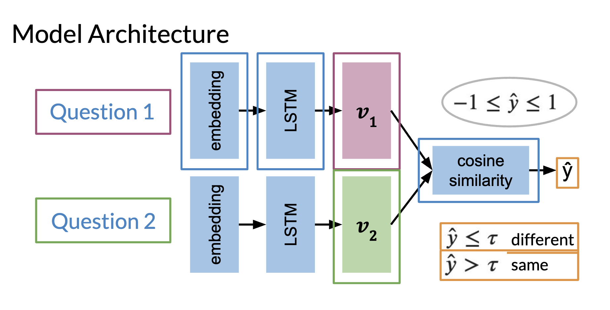
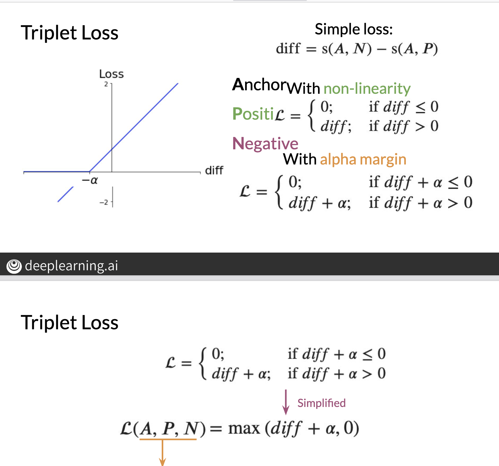

# Siamese Networks: 

- The idea behind Siamese networks is to run similar inputs through a similar model to determine if the inputs are the same. 
- A use case would be like reddit, to identify duplicate questions even though the wording is different. 
- Most models are non-linear and therefore not injective, having the same output doesn't tell us the inputs are the same. 
- Similarly, comparing input vectors isn't the best way to approach this problem. 
- An exmaple would be: "How old are you?" vs "What is your age?", even though they have no words in common, they mean the same thing. 
- Alternatively: "Where are you from?" vs "Where are you going?" have similar words but completely different meaning. This example also explains why word embeddings aren't the best for this problem. 

## Intuition: 

- Classification problems on text try to determine the words that explain why that peice of text belongs to a particular class. 
- Siamese Networks: Tries to identify what words causes 2 sentences to be similar. They work out the similarity in some way of 2 inputs and if this is above some threshold, they are considered the same. 

## Model Architecture: 

- Below is an example of a model architecutre: which we can think of as 2 sub neural networks joined together. 
- The weights between each subnetwork are the same, hence we really only train one set of weights.
- LSTM isn't always used, merely an example.
- As mentioned above, we set a threshold on the cosine similarity, where if greater than the threshold the inputs are considered the same. 
- In this case, the dimension of the embedding layer is the same as the dimension of the output vector. $v_1$

## Loss Function: 
- The loss function is rather intuitive:
    - We want a model that will ensure similar questions have a higher similarity and different questions have a low similarity. It's important to notice that we do need the latter, as a model that predicts 1 all the time would perform well if we didn't consider this. 
- For each question in the training set:
    - Set the question as an "anchor".
    - All other questions are labelled as "positive" or "negative" wrt to the anchor. "positive" if same in meaning, or "negative" if different in meaning. 
    - Ideally we would want $s(a,v) = 1$, when $v$ corresponds to a positive question and $s(a,v) = -1$ when $v$ corresponds to a negative vector. ($s$ denotes the cosine similarity of the output vectors of the Siamese network)
    - I think Summing over all anchors, positive sets and negative sets we want to minimise:
        - $l$ = diff = $ -cos(A,P) + cos(A,N)$. 
    - Notice this loss function $l$ is bounded: $-2 \leq l \leq 2$
    - We can also use a difference metric other than cosine similarity. 
- This loss function is dependent on 3 terms, the anchor, positive question and negative question. This is called the triplet loss. 
- Suppose the difference is -0.9 vs -0.88, one is slightly better than the other but way require a longer period of time to optimize further. So what we do is define a hyper parameter ($\alpha$) and introduce some non-linearity to redefine the loss as: 

- 

- By doing so, we stop training our loss once the diff is $\leq -\alpha$. (As loss is 0.)
- This allows for faster training. 
- The bigger the alpha, the more time required to train. 
- When beginning to train we want to pick triplets where $s(A,P) ~ s(A, N)$, this is because these correspond to where the similarity is similar but in reality they are opposites. By choosing these examples, our model becomes more robust at identifying similar questions. 

## Calculating Loss:
- Suppose we have our dataset of similar questions, we can organise in a way such that the first column is a set of questions and the second column is another set of questions. Do this in a way such that no questions in either column are similar to each other. We can batch our data into size ($b$) to enforce this.
- Now we can feed one column to the top layer of the network and the other column to the second subnetwork. 
- again: the embedding layer size is the same as the vector output size. 
- We then output from each layer a matrix of dimensions: ($b$ x $d$) ($d$ = embedding dimension). One row for each question fed in.
- We can then compute a ($b$ x $b$) matrix of similarity scores (denote as $S$), $S_{i,j} := s(v_1,i, v_2,j)$ (number correspond to different subnetwork vectors) 
- The diagonal of this matrix corresponds to the similarity scores of similar questions (ie: $s(A,P)$) and the upper/lower parts of the matrix correspond to $s(A,N)$.
- Ideally we want the diagonal of the S matrix to be close to 1 and the upper/lower parts to be close to -1. 
- We can then take the average of this to get the total loss. 

### Optimizing Loss:
- I mentioned earlier how we can choose specific harder examples for our model to train on to be more accurate. 
- Below are 2 tricks we can use to do this. 

Mean Negative: 

- For each row of S, take the mean of the values off of the diagonal. 

Closest But Less Than: 

- For each row of S, pick the example that is closest and less than the value on the diagonal. 
- This will point to the negative question for that row, that has the biggest inaccuracy of the other negative questions. ie: question that model thinks is most similar but isn't.  

We modify the loss function to account for these new representations of loss, and by focusing on these terms hope to generate a better model overall. 

## One Shot Learning: 
- Classification in NLP is the process of assigning a class to a piece of text. 
- One Shot Learning is the process of deciding if one piece of text is similar to another. 
- Consider signature detection:
    - We can either compare against the classes of other people and assign the person (classification).
    - OR 
    - Determine if the signature is similar to historic patterns of the signature. (doesn't require retraining once new data is added.)
- Although the Siamese network architecture is for NLP, we can extend to general problems as it's all just vectors. Maybe the problem isn't classification, it's is this similar to some seen data? 
- Once the similarity function/model is trained, we can generate a vector representation that we can compare with others to check similarity. 
