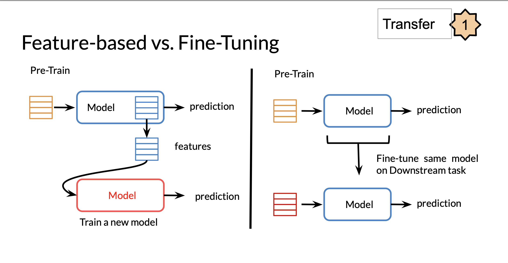
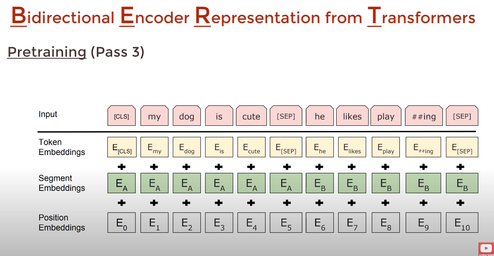
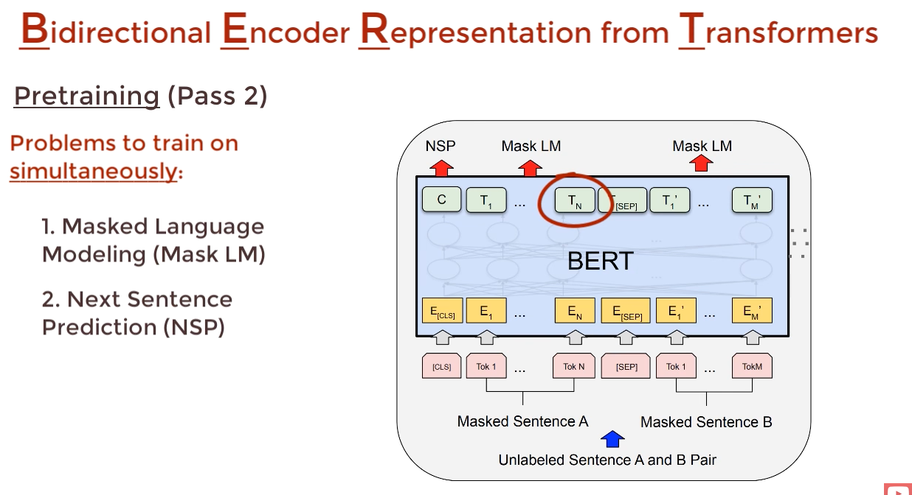
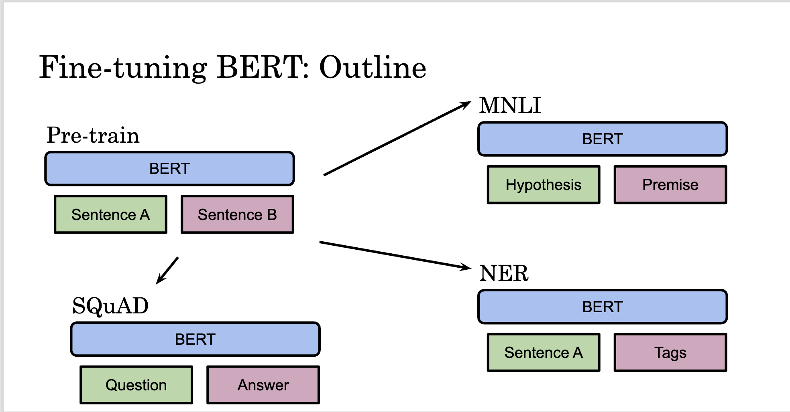

# Transformers Continued:

- In general transfer learning: 
    - Reducees Training Time
    - Improves Predictions
    - Good for small datasets. 

## Transfer Learning

- We know the idea behind transfer learning, is to use some weights/model parameters that have already been trained for a different but similar use case, then introducing some other weights to fine tune the model to the new use case/task. 
- An example would be if we built a classifier to classify movie reviews, we could then apply some fine tuning/transfer learning to classify restaurant reviews. 

### 2 Main Types of Transfer Learning: 

- Feature Based:
    - Where we use a model to generate our features, which we can then apply downstream to another model.
    - Eg: using CBOW to generate word embeddings, then using these word embeddings for classification is an example.
- Fine Tuning: 
    - This is the process of using similar weights to the model that has been trainied, and adding a new layer at the end to adapt the model to a new task. 
-  

## Different Model Types: 
- Transformer Models are Encoder/Decoder
- GPT = Decoder Only
- BERT = Encoder Only
- T5 = Encoder/Decoder. 
- Elmo = Bidirectional LSTM based RNN model. 

## BERT: Bidirectional Encoder Representations from Transformers:
- Unidirectional models will try to predict the next word given the previous words/context. BERT will try to use previous as well as the future words to predict the current word. 
- BERT will use multi-mask language modelling - which is where we omitt multiple words in the sentence.
- BERT is also capable of next sentence prediction. 
- BERT uses an encoder transformer only, (stack of 12 Encoders).
- BERT will create different word embeddings based on the surrounding words (due to the attention mechanism), this allows for the same word to have different embeddings, while is really the advantage over CBOW. Ie: BERT has different word embeddings for the same word due to the context of the word.
- Ultimately we can think of BERT as a smart/context aware way of generating word embeddings, then we can fine tune this model to our specific use case. 

### BERT: PreTraining: 
- The BERT model is trained using a "Masked Language Model" (MLM), which is where we try to predict words given the surrounding words (similar to CBOW). This model will mask a fixed percentage of words (eg: 15%), then try to predict the masked words. (can think of masking as covering). 
- BERT is already trained on NSP (Next Sentence Prediction), given 2 sentence to determine whether one follows the other. This way BERT learns the relationship between sentences and predicts the next sentence given the first one.
- BERT is used in Google Search. 
- PreTraining refers to the steps before the model is optimized for our specific task. In particular it's where we train general features before fine tuning to our problem. 
- Formally, for training: 
    - We train the NSP and Masked LLM simultaneously. 
    - We feed into BERT a sentence that is concatenated with the 2 sentences (whether it's question, answer OR 2 sentences next to each other). Therefore we can think number of inputs as: 1(start of sentence token) + len(sentence 1) + 1 (seperator) + len(sentence 2)
    - The original input word embeddings are pretrained embeddings but then we encode the position as well as the sentence number, to this end we use a technique similar to positional encoding:
    - 
    - Recall, transformers encoders can generate encodings for all words simultaneously. Hence the number of word embeddings in the input, is going to be the same as the word embeddings of the output. 
    - 
    - In the figure above, the first output is a binary value for the prediction of whether the sentences follow each other. 
    - Also worth noting the input and output vectors are of the same dimension. (Remember: BERT is just a special Encoder). 
    - We then pass each of the output vectors through a feed forward layer to get the predicted output. However we only consider the Cross Entropy Loss for the masked token, not each of the encodings. We add this word prediction loss with the NSP binary loss to get the final loss.
    - The architecture is slightly different based on the use case for a question/answering model. 

### Bert: Fine Tuning: 
- This is where we can modify the outputs based on our specific use case. 
- Eg: for Question Answering: 
    - Can provide a passage of text + a question and can train the final fully connected layer to output the answer. 
    - Any weights before the fully connected layer are fine tuned (not modified much). 
- The below depicts how your sentences would change based on the specific use case. 
- 

## T5: Text to Text:
- The T5 model is a transformer based model that can apply to various tasks at the same time. Eg:
    - Classify reviews
    - Question/Answering
- Ie: T5 is a multitask model, but how do use build this. 
- T5 will gauge from the input whether there the task is classify/question-answered base etc. 
- The T5 Model Architecture built is very similar to the transformer architecture we've seen before. It indeed uses Encoder-Decoder modelling with 12 stacked Encoders/Decoders each. (220 million parameters)
- We train it by using the same masking technqiue, but masking multiple words from a sentence. We then have a sequence input which is the sequence without the masked words and the output is the masked output. 
- We consider the loss here to be only for the error in generating the masked tokens not the whole output. (just like we did with BERT pretraining)
- T5 model uses the Prefix Language Model Attention Mechanism: 
    - This means that for the inputs we use bidirectional attention. 
    - Causal Attention (attention only on what's been seen previously) on the outputs. Ie: attention on the inputs as well as the outputs generated before the current time step. 

## MultiTask Training Strategy: 
- We'd want to use language models for multiple tasks:
    - Question Answering
    - Classification
    - Named Entity Recognition
- We build a model capable of doing this by taking a subset of training data from each of these tasks. (ie: we make our training data for the model by mixing the kinds of data - that way the loss is made up of a combination of it's performance on different tasks).
- We then evaluate our model on each task as a whole and then use the GLUE metric to get an "averaged" idea of general performance on NLP task. 
- Temperature Based Mixing is a strategy used to mix different datasets, where we take a different weighted number from each dataset (where each dataset corresponds to a type of task).

### Fine Tuning: 
- To fine tune, we can add various layers to the model to assess it's performance on the exact task we're looking for. 

#### Gradual Unfreezing Layers:
- This is where we freeze all the layers in the network apart from the last layer. Meaning that only the parameters in the last layer can be adapted for performance. 
- Then we unfreeze the last and second last layers, then assessing performance. 
- Iteratively carrying on down till all layers are unfrozen. 

#### Adapter Layers:
- Introducing new feed forward layers within the encoders/output layers, which adds more trainable parameters to our model, allowing for adaptability to our use case. 

### GLUE: General Language Understanding Evaluation:
- A metric used to evaluate a models performance towards general NLP tasks. 
- Types of tasks:
    - Sentiment
    - Similarity
    - NER
    - Is this sentence a contradiction of itself? 
- We can then compare models based on their GLUE score - which is something like ChatGPT will be compared against. 
