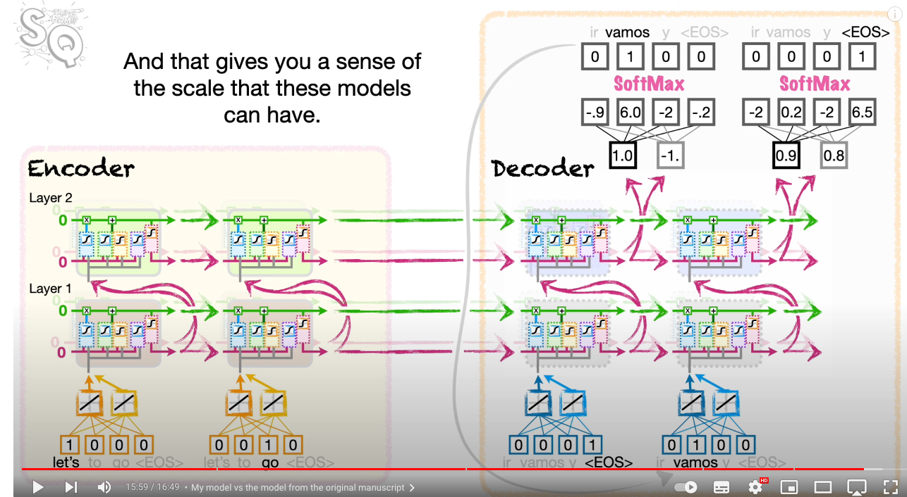
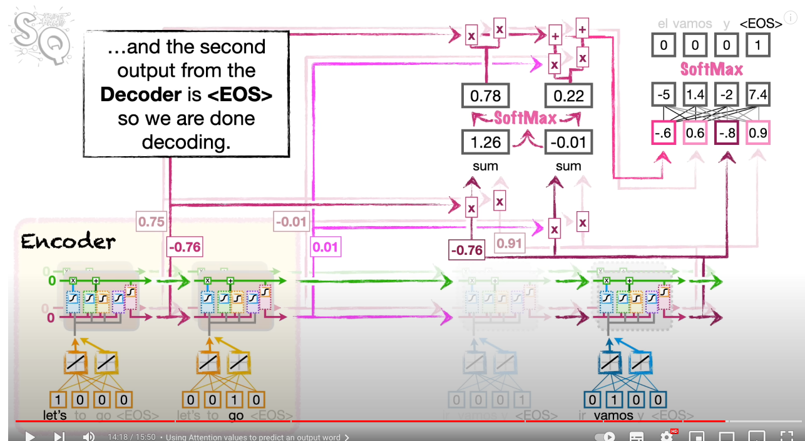
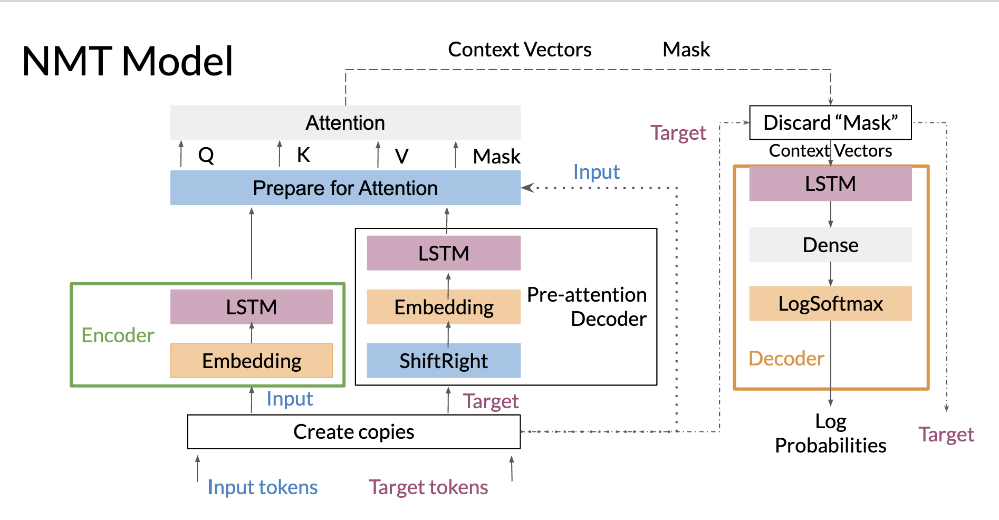

# Sequence to Sequence Models:

- Like the name suggests, seq2seq models are models that take in a sequence and output a sequence where the sequences can vary in length. 
- Some examples: 
    - Language Translation
    - ChatGPT
- The stat quest video on Seq2Seq is very good: https://www.youtube.com/watch?v=L8HKweZIOmg

## Seq2Seq:
- The seq2seq model is a supervised learning model that came about in around 2014 and utilised LSTMs.
- The basic idea is:
    - We would generate some word embeddings for some text.
    - Pass into a series of LSTMs that would output a vector of same length as LSTMs. This would be the encoder step as we can think of it as encoding the input. 
    - The output of the encoder is called the Context Vectors, which are passed as short term/long term states into the LSTMs on the Decoder. (ie: the initial states on the decoder side come from the encoder side)
    - We can think of the context vectors as a summary of the input sequence. 
    - The Decoder will apply a series of LSTMs to the first token in the EXPECTED output and then pass into a fully connected layer. (This is usually the end of sentence token for some reason)
    - Finally applying softmax to get the predicted word on the decoder side.
    - The short term/long term state from the first set of LSTMs on the decoder are sent as input to the next set of LSTMs which will predict the second word. 
    - One the Decoder Side: we pass the first predicted word as input to the next set of LSTMs. eg if we wanted the output to be: "We are going to play football", then:
        - We pass in the end of sentence token to the first LSTM.
        - Whichever word is predicted (hopefully "We"), we generate it's word embedding and pass into the next set of LSTM units. 
        - We keep doing this: spitting out words until we reach the END OF SENTENCE TOKEN. 
        - An alternative when training would be to stop once we've reached the desired output instead of when we reach the end of sentence token. (This is called Teacher Forcing). 
- The seq2seq model uses multiple LSTM units on the encoder/decoder side. 
- Formally:
    - We have multiple layers of LSTMs that take in the word embeddings.
    - We then utilise deep LSTM units where the input from the first layer of LSTMs is passed into the next layer.
    - The weights / biases of the LSTM units are shared when applying the operation to different word embeddings, the weights change between layers and depths. 
- The below shows a seq2seq model where:
    - We predict the spanish translation for english text. 
    - Word Embeddings are 2 dimensional.
    - We have 2 layers LSTMs and 2 depths of LSTMs. (must be same on both Encoder/Decoder side)

- The original Seq2Seq Model had:
    - Input had 160,000 tokens as vocabulary, 80,000 tokens as vocabulary on output. 
    - Word Embeddings were 1,000 dimensional. 
    - 4 Layers of LSTMs with 1000 LSTMs as depth. 
    - Fully connected layers on decoder side would predict vectors with 80,000 length to match with the output vocabulary. 
    - Had 384,000,000 parameters. (which is how we start to have models with billions of parameters)

## Seq2Seq with Attention: 
- Attention models are another layer up on Seq2Seq models in the sense that we find Seq2Seq model performance drops after we start to use longer input/output sequences. 
- This intuitavely makes sense as we start to lose information after many LSTM units. The % of long term memory is between (0,1), which applied many times on the starting input words, start to lose meaning by the time the leave the encoder. 
- The trick here is to take a weighted sum of all the hidden states in the encoder (we get a short term and long term state) after every input word. Thus if 20 input words, 20 hidden states. We take a weighted sum of the hidden states and then output the context vectors which are fed into the decoder. 
- By taking a weighted average, we allow for older information to be carried over. We optimize the weights of each hidden state, doing so determines which words in inputs are more important. 
- Note these weights will vary based on the number of states you have and thus the number of input words you have. 

### Attention Layer: 
- Formally the attention layer calculates a weighted sum of the hidden(AKA short term) states of all the LSTMs in the encoder. 
- Let $n$ be the LSTM output dimension and $m$ the word embedding dimension. 
- Suppose we have $k_{input}$ terms in our input sequence, and therefore $k$ hidden states. 
- Suppose we have $k_{output}$ terms in our output sequence. 
- the $i^{th}$ hidden state: $h_i$ represents a combination of the information before state $i$ and the information gained from the $i^{th}$ input. (so intuitavely as it's a short term state is more dominantly the information gained from the $i^{th}$ input)
- We know we pass each hidden state output on the decoder side into a fully connected layer which then predicts the next word. 
- The attention layer will adapt this. 
- For each hidden state on the decoder side ($n$ dimensional), we take it's similarity score with every hidden state on the encoder side. (note we concat hidden states where we have deep LSTMs). We can think of this as getting a similarity score between a representation of a word on the decoder side and a word on the encoder side. (As the hidden states are really just representations of words/information). 
- For a particular hidden state on the decodder side we then have a sequence of similarity scores of dimension $k_{input}$. We can apply the softmax function to convert these into probabilities, which we can intuitavely interpret this as how alike 2 words are on the encoder side vs deocder side. The more alike 2 words are, the more meaning the word should carry in predicting the output word. This way if a word in a long sequence is many words ago, it can still inifluence the probability of the predicting word based on similarity. 
- Once we have our weighted probabiities we take the weighted average of the hidden states in the encoder side which will produce a vector (not matrix) length $(d \text{ x } n)$ (where $d$ is the depth we have in our LSTMs). 
- We then concatenate this vector with the hidden state of the input word before it goes into the fully connected layer. Implying the fully connected layer now has inputs of length $(d \text{ x } (n+1))$
- 
- Again, this allows more historic words to have an input in predicting the current word on the decoder side. Which is ideal for longer sequences. 
- Most common similarity score metric is the dot product. 
- Here we notice that we would largely benefit from having a matrix of similarity scores. I.e. a matrix that stores the dot product of hidden states on the encoder and decoder side. This will allow us to calculate probabilities quicker and thus build the attention mechanism quicker. 
- When speaking about attention models, "Alignment" is also a term referring to how similar 2 vectors are.
- One of the pro's of this method as it considers all words in the sequence, not just in a particular order. 

## Keys, Values and Queries: 
- We can see in the attention mechanism, we need the similarity scores of all the hidden states on the encoder and decoder side. Which we can then apply softmax on and then retrieve the weighted context vector which is added as input to the fully connected layer. 
- We store this information as queries (Q), keys (K) and values (V) pairs, which gives us a faster retrieval/calculation. 
- Attention(Q, K, V) = $softmax(\frac{QK^T}{\sqrt(d_k)})$
- Note we scale the product of queries and keys by the square root of the length of the key-vector size, this is found to imporve performance.
- Suppose we have $n_{query}$ queries and $k$ hidden states on the encoder side, $n$ dimensional LSTM output units. 
    - Q: Queries: Decoder side hidden state vector. (hidden states are stored as rows) ($\in R^{n_{query} \text{ x } n}$)
    - K: Keys: All encoder side hidden states. (hidden states are stored as rows) ($\in R^{k \text{ x } n_{query}}$)
    - V: Values: Encoder side hidden states where weighted average is taken. (rows again) ($\in R^{k \text{ x } n_{query}}$)
    - We can see K and V are similar. 
- For the way we implment attention V and K are basically the same, however there are other ways to calculate attention where we may use different values. 
- We can see that $Q*K^T$ is an $R^{n_{query} \text{ x } k}$ matrix, where the rows are the weights for the hidden states. 
 

 ## Teacher Forcing: 
 - Recall generation happens on the decoder side by feeding the first predicted word as input to the set of LSTMs, to then predict the next word and this loops until we get the end of sentence token. 
 - Hence it's important when preprocessing our data to have an EOS token. 
 - Sometimes we also use start of sentence token but the original paper used an EOS token. 
 - Part of the problem here is that once a generated/predicted word is incorrect, these errors can propogate easily. 
 - Errors tend to happen early on in the model as the model is naive at the start.
 - This is where teacher forcing comes in, where we will use the correct word as input into the next set of LSTMs instead of the predicted word. 
 - This makes training much faster, and improves performance.
 - There are slight variances of Teacher Forcing, one such is in the first few generated words we always feed in the correct word but later on in the sequence we pass in the predicted words. This technique is called Curriculumn Learning. 

 ## Neural Machine Translation: 
 -  
 - In the architecture above we have a "shift right" this is to introduce a start/end of sequence token. 
 - The pre-attention decoder is setup so we can compute the hidden states of the decoder BEFORE attention is added. This is so we can generate our Queries, Keys, Values matrices, needed for attention. 
 - In the pre-attention decoder, we must use teacher forcing, as we won't be computing probabilities/feeding into the fully connected layer. (only the LSTM structure.)

 ## Evaluating NMT Models: 
 - We know how to feed a sequence in to get a sequence out, but what metric do we use to evaluate how good our model is? 
 

 ### BLEU Score: 
 - The BLEU score compares the generated sequence with some reference sequences.
 - Reference sequences are typically human generated.  
 - For each word generated it adds a count if the word appears in the reference, but doesnt add multiple counts for the same word. Then divides by the total length of the sequence generated. 
 - This is a rather basic metric. 
 - It doesn't consider semantic meaning, eg if the sequences mean the same as the reference just slightly different words. Eg:
    - Generated: I am really hungry.
    - Reference: I coudld eat a lot of food.
- Nor does it consider the order of a sequence, the below would produce a perfect Bleu score, but in reality is a poorly generated text:
    - Generated: Hungry am really I. 
    - Reference: I am really hungry. 

### Rouge-N Score: 
- Can be thougt of as recall.
- Looking at your reference sentences, calculate a BLEU score with the reference and the generated text as the candidate. (ie the other way around). This is called the ROUGE-N Score.
- The N relates to Ngrams, where instead of just looking if words are present, we see if N-grams are present. This improves upon the BLEU in the sense it considers orders of words. 
- We can then combinate Rouge-N and BLEU like we do with precision and recall to get an F1 Score. 
- $F_1 := 2\frac{bleu \text{ * } rougen}{bleu \text{ + } rougen}$
- Though the Rouge-N score and Bleu don't really consider order/semantic meaning. 

## Sampling + Decoding: 
- We know the decoder will feed the output of the LSTM into a fully connected layer, which will then output some probabilities. 
- However, choosing the word with the highest probability doesn't always generate the most realistic text. This is usually a problem when we have longer sequences. 
- Suppose we have a vector of probabilities, and we want to select a word as the output of this step: 
    - Greedy Approach/Highest Probability: Selecting the word with highest probability, can make models deterministic and may not generate the most accurate text. 
    - Random Sampling: Sample a word, based on the discrete distribution provided by the probability vector. 
    - Temperature: We discussed temperature before, but the idea is temperature introduces some randomness to the words we select, and therefore we don't always pick the highest probability word. Temperature is a hyperparameter between 0 and 1. 

### Beam Search: 
- Beam search is a better approach to selecting words.
- It doesn't just consider the word, but considers the reprocussions of selecting that word by considering the probability of the sequence as a whole. 
- One of the hyperparameters is called Beam Width, which defines the number of sequences we keep track of/number of terms we look ahead to. 
- We keep track of the probability of B sequences, until we reach the end of sentence token OR we've reached our beam width. Then in the end we choose the sequence with the largest probability. 
- We can use the Decoder to compute the conditional probabilities. However we need to run the model B (beam width) times as we need to compute different conditional probabilities. 
- Eg if we want P(w3|"My Name"), we need to feed start of sequence token, then "My", then "Name" into the decoder LSTMS. 
- This can become quite computationally heavy.
- Furthermore this method penalises longer sequences as the product of terms between (0, 1) tend to zero. ie: shorter sequences is the product of fewer small numbers and is in general more likely to produce higher probabilities vs longer sequences. To this end, we can normalise the probability by the number of words in the sequence. 

### Minimum Bayes Risk: 
- Take several generated sequences.
- For each sequence compare its similarity against the other samples and take the average. The sequence with the highest similarity is our prediction. 
- The similarity here can be calculated using the rouge-n score. 
- This is better than random sampling and greedy decoding. 
