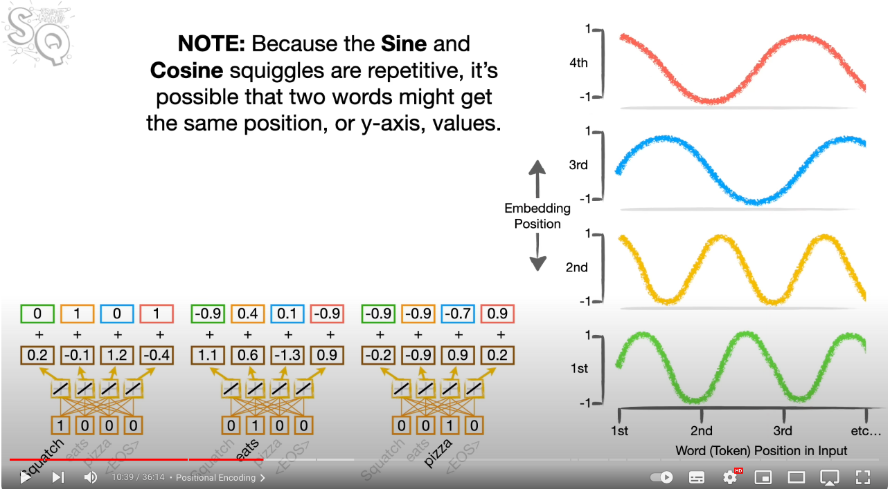
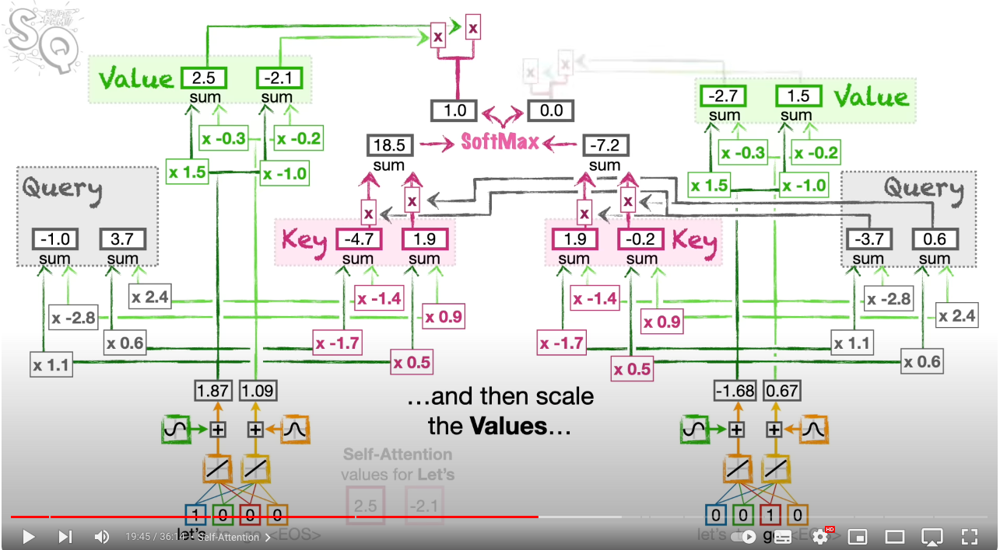
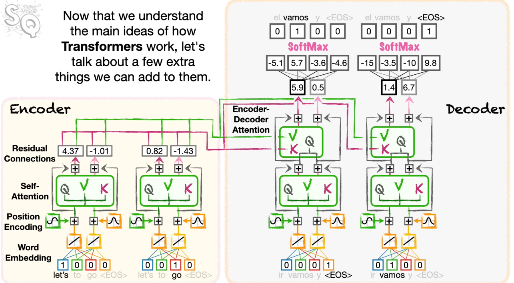

# Transformers: 

- Transformers is another advancement on Seq2Seq models. 
- Tools like ChatGPT run Transformers in the background. 
- We'll go through some comparisons with RNNs. 

## Word Embeddings + Positional Encoding:
- Like most of our models in NLP, our sentences go through an embedding layer. 
- However, one thing that is different here, is we add a "positonal encoding" layer.
- There are many ways to positional encode but one way is to add a vector to the word embedding of a word, based on where that word is in the sequence. This vector that we add is based on some sine/cosine values that are fixed. This means the same word will have a different positional encoding (and thus a different word embedding) depending on where it is in the sequence. 
- For the vector that we're adding for positional encoding, it is made up of different values from sine/cosine curves. Specifically, each element in the vector relates to a different sine/cosine curve. (from this we infer if our word embedding is $n$ dimensional, we have $n$ curves) We can imagine this curve having "word token position in input" on the x-axis, and therefore for each position we have a sine/cosine value.
- Due to periodicity for different position inputs, may generate the same value, but the other elements will have different sine/cosine values for meaning the overall vector will be different. Moral of the story: **each input word will have a unique positional encoding vector**
-  

## Attention: 
- The seq2seq model, that was built around LSTMs also used a form of attention, where we:
    - Calculated the similarity between the hidden states of in our encoder with a hidden state in the decoder.
    - Applied softmax to the similarity scores.
    - Took a weighted average of the hidden states in the encoder and fed into the dense layer. 
    - Here the query(Q): decoder hidden state, keys(K): encoder hidden states, values(V): encoder hidden states. 

### Self Attention:
- Transformers use an alternative mechanism to attention, (from what I can see, I don't think transformers use LSTMs). 
- The intuitive idea is the same as before, we want to emphasise on important words within the sentence. However in this case, we also apply the attention mechanism to the words in the input sequence. Ie: We alter the encoding of a word in a sequence based on the other words in the sequence. This is because words in the input sequence may relate to each other and we want the model to pick up on this to adjust the output encoding accordingly. 
- Eg: "I got my car straight from the showroom, it was new", we want "it" to relate more to the word "Car" than "showroom" as that's what it refers to. 
- Suppose our word embedding is $n$ dimensional, have $k$ words, we'll repeat the following for every word embedding: 
    1. Apply 3 **LINEAR** layers (output dimension = $n$, thus all $(n \text{ x } n)$ matrices):
        - One layer will output the query(Q) for a word.
        - One layer will output the key(K) for a word.
        - One layer will output the value(V) for a word. 
    2. Compare the query of a word with the keys of the remaining words (itself). (ie: workout the similarity scores - one way is dot product). ($k$ similarity scores)
    3. Compute the softmax vector for to represent a probability distribution. (normalise by square root of the length/dimension of the key vectors ($n$))
    4. Take the weighted average of the value vectors. 
    5. Output vector is now the attention encoded word embedding, this incorporates the information from the other words. (more from words with higher similarity.) (output vector still $n$ dimensional.)
- The dense layers we apply are the same for every word and thus the queries,keys,values can be calculated for each word in parallel which gives us access to parallel computation. 
- The above describes a "Self Attention" cell, which we can stack to have multiple attention mechanisms for complicated sentences/paragraphs. Each cell will have it's own weights just like how we stacked LSTM cells in the Seq2Seq models. This is called Multi-Head Attention. (original model had 8 stacks of self attention cells)
- Each Self Attention Cell will have $3n^2$ training parameters. 
- If we do use multihead attention, then we can concatenate the vectors BUT we do reduce the sizes of the matrices, to have dimensions: ($n \text{ x } \frac{n}{h}$) (h = number of heads). That way when we concat, the size of output vector is the same as embedding layer dimension ($n$). This is why it's important to choose a nicely divisible dimension of word embeddings/number of heads in your multi-head attention layer.
-  

## Residual Connection:
- After an attention cell, we will add the output vector with the input vector to the attention mechanism. 
- This is because the attention mechanism will find it hard to preserve the information from the other words, word embedding and the positional encoding as well as the input. 
- Residual connections are particularly useful for the vanishing gradient problem. If we use Relu activations, then any negative value will have gradient 0 and thus the information being carried is lost. Hence we add the original vector back to reduce 0 values. 
- We want attention to focus on relationships between words not necessarily the word itself. 
- Formally: 
$$ v := v_{attention} + v_{attention:input}$$

## Transformer Architecture:

### Encoder:
- Transformers create encodings that are:
    - Word Meaning Representative (include information from the original word embedding).
    - Position Aware (includes information aboute the positional encoding).
    - Encode relationships based on the surrounding words in the input sequence. (Self Attention)

### Decoder: 
- The decoding process is similar to what we have seen in the seq2seq model, but does have some key differences. 
- Once we have built our encoder and worked out encodings for each words, we can start to decode. 
- The decoder trainable parameters are mostly independent from the encoder. 
- If doing machine translation, we will have to generate new word embeddings for the new language, if it's the same language we maybe able to get away with the same word embedding BUT NOT the same encodings. 
- We start with an encoded sequence and want to generate a response/sequence. We start by decoding the EOS token, but the general decoding steps are:
    - Feed the input word through a word embedding layer.
    - Feed the word embedding through a positional encoding layer. 
    - Then feed through a self attention cell. (Note: self attention is only applied to the terms on the decoder/encoder side. ie: the first token being decoded will only have similarity with itself, the second token being decoded will only have similarity with itself and the first token etc). This layer again, allows information to be preserved based on what has been generated already. This is also known as *Masked Multihead Attention* as the attention mechanism will only use attention based on the terms already generated. 
    - The output of the attention cell, is then passed into a residual connection (adding with it's own word embedding/positional encoding). 
    - **IMPORTANT:** We then feed our output through a **Encoder-Decoder Attention Mechanism**. This is a cell where we apply attention in a similar way to the seq2seq model. It's to allow information from the input sequence to influence the output generated. To this end we add new trainable parameters:
        - On the encoder side we have 2 new dense layers **applied to the output of residual connection** (again both $n$ output units) that will generate keys(K) and values(V). 
        - On the decoder side, we have a new dense layer also **applied to the output of residual connection** (again, $n$ output units), this will be the queries(k).
        - We then apply an attention mechanism as we have the keys, queries and values, can calculate similarity scores, get the softmax and then take the weighted average to produce another $n$ dimensional vector which encodes the input information, as well as the decoded output information. 
        - Note: we can also stack Encoder/Decoder Attention mechanisms. 
    - As we have done another attention mechanism, we pass through a residual connection, adding the inputs prior to the attention mechanism. (may also apply dense layer with a Relu activation function - depends on structure)
    - We now have a decoded $n$ dimensional vector and we feed through a fully connected layer to get the probabilities of the next word in the sequence. (output dimension is the size of output vocabulary)
    - We can then apply a few techniques like Beam Search or Minimum Bayes Risk or Greedy to select the next word. 
- We repeat the above until we get an EOS token or if using teacher forcing, until the expected sequence has been fed in. 
- Note in the feeding forward of an input, we may repeat the attention mechanisms many times. 
- **Encoder-Decoder Attention** gets it's name as it's an attention mechanism that compares the relationship between the decoding values and the input sequence output encoder values. 
- **Self Attention** gets it's name as it's only comparing the current words' relationship between other words in the input sequence. 
- As an implementation note, if we want to calculation self attention on the deocder side, we want to mask it. Which means we only weight vectors that have already been generated. This is the equivalent of setting those weights to be zero. Which is the equivalent of adding a special matrix to the similarity score matrix which only impacts changes the upper diagonal. In particular we add a matrix with a -infinity on the upper diagonal. (softmax(-inf) = 0)
### Full Architecture: 
- The below depicts the full architecture a transformer uses.

-  

- Note one trick to handle varied sequence length is to normalise each vector after each component in the transformer. 
- The above is one possible transformer architecture but we can have many variations on it. The main idea is to use attention mechanisms. 
- Below is the T5: Text to Text Transformer architecture. 
- Some differences: 
    - We have some normalisation steps. 
    - Have a feed forward layer.
    - Repeating the encoding/decoding steps many times. (with different parameters, which is why parameters can scale very quickly)

-  

### Layers: 
- A Linear layer is a single matrix multiplication layer, with no activation.
- A Dense layer is a single matrix multiplication layer, but can have an activation. 
- A Feed Forward layer is a collection of Dense layers, and thus will have multiple matrix operations/activations applied to the input. 

### Parameters:
- Due to the variety of transformer architectures there's no 1 set number of parameters, however we can note some general parameters down. 
- Every attention mechanism will generate queries, keys, values through a linear layer for each. This is an introduction of $3n^2$ parameters. ($n$ := embedding dimension). Multihead attention will vary this number slightly as we reduce the matrix sizes but then also have more matrices. This is where we decide to use word embeddings of the sizes: $2^j$ and number of heads in Multihead attention to also be a power of 2. This gives easy division and our vector sizes are preserved. 
- As an idea, Llamma 70B uses word embeddings of size 8192. Leading to 200M parameters just on 1 attention mechanism. 
- Llamma-70B is built with 32000 tokens, thus as the word embeddings are trained in the model, and should have dimension 8192, this is 260M parameters.  
- So we start to see how quickly these parameters can grow. 
- We also run the decoder many times, (N times), each wit a different set of parameters, which again, causes a huge increase in parameters. Note: **Running through the decoder N times, is done in parallel NOT sequentially**. Ie, can think of a stack of decoders. 